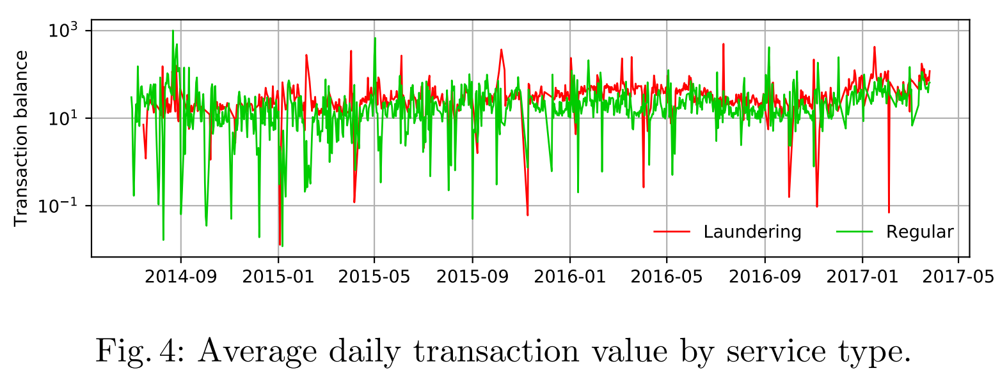
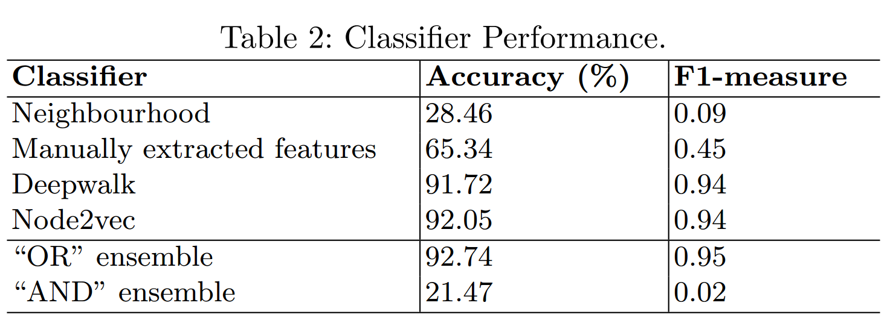
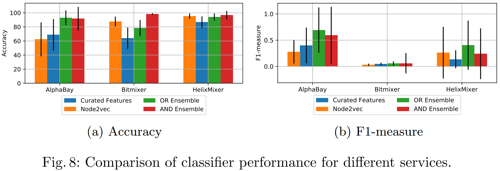

# Characterizing and Detecting Money Laundering Activities on the Bitcoin Network
文章的背景是比特币是匿名的，因此许多的网络犯罪和黑客使用比特币从事非法活动。因此文章对洗钱服务进行了研究。现有的研究没有详细研究洗钱交易和常规交易的图属性的区别，未利用自动创建节点嵌入的潜力。因此文章首先探索了洗钱交易和常规交易的区别，然后使用DeepWalk和node2vec进行研究。  
文章采集了交易的时间戳、以前的交易、交易的数量、以及输出和输出的UTXO，以此构建比特币交易图。首先使用07/2014-05/2017的有向的每日交易图来显示比特币网络的增长，计算每个图的节点数、边数和图密度，结果绘制于图3。  
  
节点数和边数逐渐增加并趋向于饱和，图密度的降低表明交易具有较少的投入和产出。图4是洗钱和常规交易的事务值的每日平均值，事务值为所有输出UTXO的总和。  
  
对于每日交易图，文章提取了5个最优的特征，分别是提供边缘信息的入度、出度比率，输出的总和、均值、标准差，以及与事务邻居有关的弱连接组件。图5展示了这5个特征的洗钱和常规交易的分布，CDF是累积分布函数，也叫分布函数，是概率密度函数的积分，用来描述一个随机变量的概率分布：  
  
## 洗钱检测
文章构建了了多个分类器来对洗钱交易进行检测，分类器基于的特征为以下四种，并使用准确性和f1度量进行评估。  
1. 基于直接邻居的分类器：根据邻居交易对未标记的交易进行分类，1）邻居中更多常规交易的分类为常规，2）邻居中洗钱交易数量大于等于常规交易数量的分类为洗钱交易，3）邻居中没有常规交易和洗钱交易的归类为常规交易；
2. 精选特征；
3. DeepWalk；
4. node2vec。

另外，文章还分别使用了两种集成技术于预测结果。集成技术集成了精选特征和node2vec嵌入的特征。集成技术分别是OR和AND，在OR中，如果两个分类器中的任何一个标记为洗钱，则结果为洗钱。在AND中，如果两个分类器都标记为洗钱，结果才为洗钱。结果如下表：  
  
## 预测洗钱实例
文章应用了基于精选的特征分类器和node2vec分类器来检测未知的洗钱交易，选择了AlphaBay，Bitmixer和HelixMixer进行比较。实验结果如图8：  
  

## 不足和启发
这篇文章对比了节点特征、DeepWalk、node2vec等，并发现node2vec的表现是最好的，但文章没有对时间效率进行分析，而实际上的大型网络中，node2vec的时间效率远远低于DeepWalk。文章没有使用GCN的方法，而是使用了基于神经网络的DeepWalk和Node2vec进行实验，并且预测准确率效果也比较好，而DeepWalk和Node2vec都可以看做是对节点局部结构信息建模的方法，说明局部拓扑对洗钱检测应该很重要。
