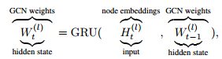
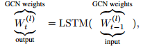
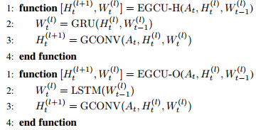
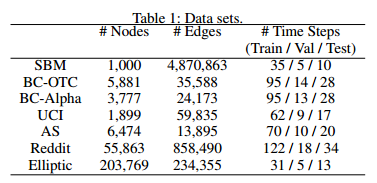
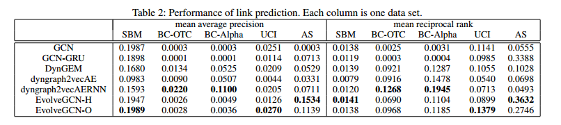
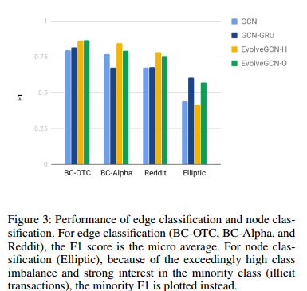

# EvolveGCN: Evolving Graph Convolutional Networks for Dynamic Graphs
图是无处不在的，可以使用神经网络对图表征进行学习，这些神经网络模型通常集中于静态图，而实际上动态图也是大量存在的。在金融网络中，交易是带有时间戳的，可能影响用户账户的性质。文章在一些成功的GNN基础上，引入循环机制更新网络，以捕获图的动态性。  
本文提出的方法是EvolveGCN，方法通过循环模型来捕获图序列的动态性，是基于GCN的，但GCN的参数是从RNN计算得出的，因此仅训练RNN的参数。  
文章的重点在于如何训练得到GCN的权重矩阵。有两种选择，第一种选择是把W看作是动态系统的隐藏状态：  
  

第二种是把W看做是动态系统的输出：  
  

一句这两种不同的方法，可以得到不同的训练方法：  
  

文章在以下的数据集中进行了实验：  
  

链路预测的结果为：  
  

边分类和节点分类的结果为：  
