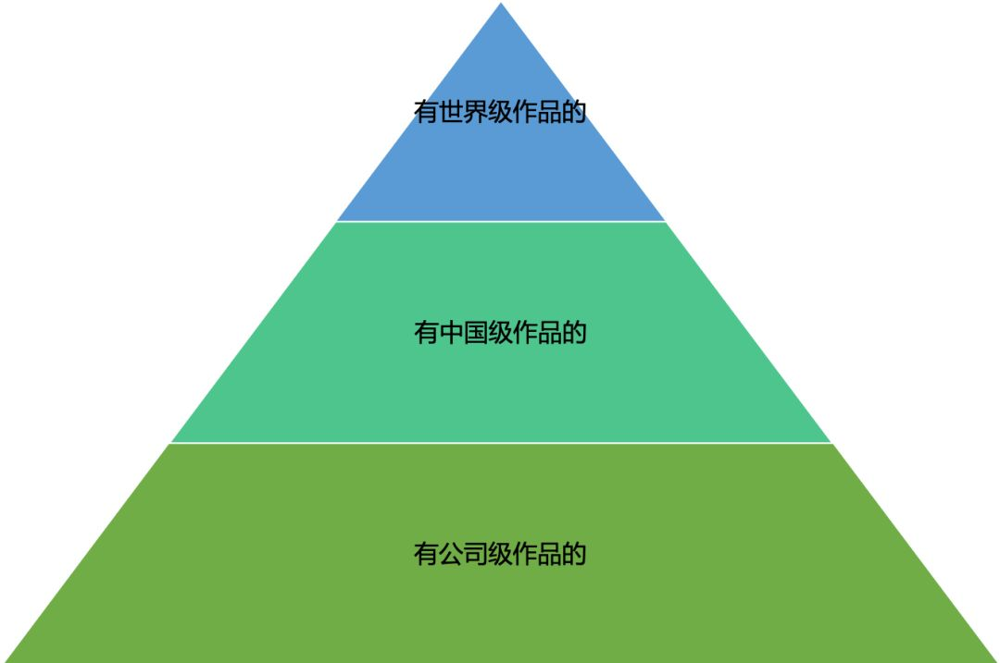

# 阿里P10毕玄
## [Java大牛程序员的学习成长路线](https://yq.aliyun.com/articles/680894)
### 技术能力成长
我大学读的是生物系，缺少了专业的训练，这个使得我在技术能力上其实欠缺的更多。回头想想，在工作的前5年，更多的都是在拓宽技术面，刚毕业的时候只会 ASP，工作前两年学会了 VB、Delphi这些神器，到工作的第三、四年比较专注的做了工作流领域。

技术能力的成长主要还是在 2007 年加入阿里以后，在加入阿里前，我是一个连日均访问量 1万 PV 都没见过的人，到了阿里后，做的第一件事竟然就是写 HSF，并且在客服的 CRM 系统上线，访问量大概是每天上百万的服务调用，无知者无畏，当时也就那么上线了，更神奇的是竟然没出现什么问题，于是继续把HSF上线到当时的交易中心，当时交易中心每天的服务调用量大概是亿级，结果上线当天就回滚了，而且还不知道到底是什么原因，这次的回滚是对我触动最大的一次（当然，触动大也有可能是后面要是解决不了，就该从淘宝滚蛋了）。

回滚后开始仔细查问题，最后发现是当时 HSF 所使用的 jboss-remoting 默认的超时参数 60s 的问题，自从这个问题后，才明白**要支撑好到了一定量级的系统，最重要的是对整个技术栈的精通，否则出问题都不知道该怎么解决或临时查**，于是才开始仔细学习 Java 的 BIO/NIO，Mina，反射，并发编程等，尽管这些东西很多在加入阿里前也看过一些书、资料学过，但到了这个时候才发现自己其实不怎么懂，那段时间密集的开始更细致的看书，翻看用到的 Mina、甚至是 Java 的各种 API 背后的源码，是自己的 Java 技能提升最快的一段时间，在回滚的两个月后，基于 Mina 完全重写了 HSF，再次上线终于一切顺利。

在那之后，随着 HSF 应用的场景越来越多，以及加上后来自己在淘宝消防队查比较多的问题，Java 方面的技能也得到了不少成长，而同时也发现了很多的 Java 问题还得对 JVM、操作系统层面有一定掌握才行，尤其是 JVM，于是当时和还在阿里的撒迦经常一起周末跑到公司来结对看 JVM 代码，:)。在撒迦的帮助下对 JVM 的掌握终于也越来越好，那段时光会让自己明白**很多东西只有看了代码，并且有相应的使用机会才能真正的掌握。**

在 HSF 之后，去做 HBase，学习了很多在存储方面的技能，这也是我之前完全不懂的领域，在HBase之后，开始做第一代容器产品 T4（寓意是第四代淘宝技术），进入彻底不懂的领域，虚拟化、Cgroup 等等都是那个时候才开始学习，但因为没详细研究过代码，并自己去做改造，其实到今天也就是点皮毛而已。

对于程序员而言，**技术能力的成长显然是最重要的**（程序员行当里最赞的一句就是：Talk is cheap, show me the code!），我自己其实很多都属于被逼的成长，当然这样通常反而也是最快的，很多同学会觉得自己没碰到这样的机会，所以成长就比较慢，我会非常建议的是**可以尝试自己去创造一些场景**（当然，如果本来就是工作需要就更好了），**来学相应的技术能力**（例如学 Java 的通讯框架，可以尝试自己基于 BIO/NIO 写一个，然后对比 Mina/Netty 这些成熟的，看看为什么写的不太一样，又例如学 Java 的内存管理，可以尝试自己写程序去控制 GC 的行为，例如先来一次 ygc，再来两次 fgc，再来 5 次 ygc，再来一次 fgc之类的，学的时候除了一些入门的书外，我非常建议去翻看源码，最后你会发现**所有的书都不如源码**），这样才能真正的理解和学会，否则其实很容易忘。
### 架构能力成长
说起架构，在我刚工作的第三年负责工作流系统的时候也做过，但直到后来在阿里做 T4、异地多活，我才有了真正更强烈的感受，对架构师也有更深的一些理解。架构呢，我现在的理解基本是一个结构图，当然有不同视角的结构，但这个图里的部分呢是多个团队来做的，甚至是跨多个专业的团队。

在做 T4 的时候，由于 T4 涉及到了标准的一个 Java WebConsole，一堆的运维体系，容器技术等，这是一个至少要跨三个团队的结构，无论是从研发视角还是部署视角都是如此，因此作为 T4 的架构师，**怎么设计好整个的结构，各自的边界、接口是我当时最大的感受，让跨专业的多个团队能更好的协作**，在这个阶段中**最重要的要考虑的是怎么根据整个项目的优先级来调整每个部分，以及作为一个不是全懂的架构师怎么更好的确保结果**，我自己的感受是 T4 让我学会了从一个只做自己专业系统的架构师成长为了能做跨专业的系统的架构师。

在做异地多活的时候，感受就更加强烈，因为这个跨的专业数、整个参与的人数完全是上升到了一个非常大的程度，各个专业、系统的人都需要看整个架构才能知道自己应该做什么，扮演的角色，在做异地多活整个项目过程中，作为总的架构师，我自己感觉的是**最重要的职责是怎么控制项目的风险，或者说作为架构师，你觉得一个项目中最重要的要掌控住的是，并且从架构上怎么设计这个部分**，这也是后来我在问很多架构师时最喜欢问的问题，一份架构文档不是说按照模板写就可以（很多的架构设计文档都是千篇一律，通常看到的都是什么都考虑，但从架构设计上并没体现这些考虑的地方是怎么做的），而是**要根据实际的项目/产品情况来突出重点，确保最重要的几个问题是从架构设计上就去掌控的**，尤其是跨多个专业团队的大型项目，这种项目准确的说是大架构师带着一堆的专业领域的架构师来做的，例如异地多活项目从架构设计上来说除了正常的结构、边界以外，最重要的是数据正确性的设计，我自己最强的感受就是异地多活才让我明白了一个大型系统的架构师是怎么样的。

所以就我自己的感受而言，**架构师对知识的宽要求非常广，并且要能非常好的进行抽象，来做结构、边界的设计，分析出当前阶段系统的重点，并从架构层面做好设计来确保重点的实现，这个相对技术能力的成长而言我觉得更需要机会，但同样在机会前需要有足够的积累**（例如写一个系统的时候，是不是主动的去了解过上下游的系统设计，是不是了解过具体的部署结构，对相应的知识点有没有简单的了解等，我自己在做 T4 前，LVS、机房/网络结构等完全搞不懂是怎么回事）。
### 技术领导力修炼
技术 Leader 我比较倾向于有前面两步积累的同学，**技术 Leader 非常重要的一点是对技术趋势的感知和判断能力**，这其实是个非常综合的能力，一到两个领域的技术深度，大的架构能力，对技术历程的理解、技术发展的思考能力，作为技术 Leader 是很需要的，然后是其他的一些作为 Leader 方面的比较综合的一些能力（例如组织搭建、建设方面的能力等，不过这些能力呢通常对技术的人来说确实会欠缺的更多一些），这个我自己还在修炼和学习中，就不讲太多了。

## [我在阿里的十年技术感悟](https://blog.csdn.net/bjweimengshu/article/details/86850215)
### 从业余程序员到职业程序员

程序员刚入行时，我觉得最重要的是把自己培养成职业的程序员，我的程序员起步比同龄人都晚了很多，更不用说现在的年轻人了，我大学读的是生物专业，在上大学前基本算是完全没接触过计算机，军训的时候因为很无聊，我和室友每天跑去学校的机房玩，我现在还印象很深刻，我第一次走进机房的时候，别人问，你是要玩windows，还是dos，我那是完全的一抹黑，后来就只记得在机房一堆人都是在练习盲打，军训完，盲打倒是练的差不多了，对计算机就这么产生了浓厚的兴趣，大一的时候都是玩组装机，捣鼓了一些，对计算机的硬件有了那么一些了解。

到大二后，买了一些书开始学习当时最火的网页三剑客，学会了手写HTML、PS的基本玩法之类的，课余、暑假也能开始给人做做网站什么的(ps: 那个时候做网站真的好赚钱)，可能那样过了个一年左右，做静态的网页就不好赚钱了，也不好找实习工作，于是就开始学asp，写些简单的CRUD，做做留言板、论坛这些动态程序，应该算是在这个阶段接触编程了。

毕业后加入了深圳的一家做政府行业软件的公司，一个非常靠谱和给我空间的Leader，使得自己在那几年有了不错的成长，终于成了一个职业的程序员，通常来说，业余或半职业的程序员，多数是1个人，或者很小的一个团队一起开发，使得在开发流程、协作工具（例如jira、cvs/svn/git等）、测试上通常会有很大的欠缺，而职业的程序员在这方面则会专业很多，另外，通常，职业的程序员做的系统都要运行较长的时间，所以在可维护性上会特别注意，这点我是在加入阿里后理解更深的，一个运行10年的系统，和一个写来玩玩的系统显然是有非常大差别的。

这块自己感觉也很难讲清楚，只能说模模糊糊有个这样的概念，通常在有兴趣的基础上，从业余程序员跨越到成为职业程序员我觉得不会太难。

### 编程能力的成长

作为程序员，最重要的能力始终是编程能力，就我自己的感受而言，我觉得编程能力的成长主要有这么几个部分。

#### 编程能力初级：会用

编程，首先都是从学习编程语言的基本知识学起的，不论是什么编程语言，有很多共同的基本知识，例如怎么写第一个Hello World、if/while/for、变量等，因此我比较建议在刚刚开始学一门编程语言的时候，还是就看看编程语言自己的一些文档就好，而不要上来就去看一些高阶的书，我当年学Java的时候上来就看Think in Java、Effective Java之类的，真心好难懂。

除了看文档以外，编程是个超级实践的活，所以一定要多写代码，只有这样才能真正熟练起来，这也是为什么我还是觉得在面试的时候让面试者手写代码是很重要的，这个过程是非常容易判断写代码的熟悉程度的，很多人会说由于写代码都是高度依赖IDE的，导致手写很难，但我绝对相信写代码写了很多的人，手写一段不是太复杂的可运行的代码是不难的，即使像我这种三年多没写过代码的人，让我现在手写一段不太复杂的可运行的Java程序，还是没问题的，前面N年的写代码生涯使得很多东西已经深入骨髓了。

我觉得编程能力初级这个阶段对于大部分程序员来说都不会是问题，勤学苦练，是这个阶段的核心。

#### 编程能力中级：会查和避免问题

除了初级要掌握的会熟练的使用编程语言去解决问题外，中级我觉得首先是提升查问题的能力。

在写代码的过程中，出问题是非常正常的，怎么去有效且高效的排查问题，是程序员群体中通常能感受到的大家在编程能力上最大的差距，解决问题能力强的基本很容易在程序员群体里得到很高的认可，在查问题的能力上，首先要掌握的是一些基本的调试技巧，好用的调试工具，就像在Java里JDK自带的jstat、jmap、jinfo，不在JDK里的mat、gperf、btrace等，工欲善其事必先利其器，在查问题上是非常典型的，有些时候大家在查问题时的能力差距，有可能仅仅是因为别人比你多知道一个工具而已，除了调试技巧和工具外，查问题的更高境界会和编程能力的高级阶段有非常大的关系，就是懂原理，一个懂原理的程序员在查问题的水平上是有明显差距的，我想很多的同学应该能感受到，有些时候查出问题的原因仅仅是因为有效的工具，知其然不知其所以然，我给很多阿里的同学培训过Java排查问题的方法，在这个培训里，我经常也会讲到查问题的能力的培养最主要的也是熟练，多尝试给自己写一些会出问题的程序，多积极的看别人是怎么查问题的，多积极的去参与排查问题，很多最后查问题能力强的人多数仅仅是因为“无他，但手熟尔”。

就像我自己，排查问题能力的提升主要是在2009年和2010年，那两年作为淘宝消防队（处理各种问题和故障的虚拟团队）的成员处理了很多的故障和问题，当时消防队还有阿里最公认的技术大神多隆，向他学习到了很多排查问题的技巧，和他比，我排查问题的能力就是初级的那种，我印象最深刻的是有一次我们一起查一个应用cpu us高的问题，我们两定位到是一段代码在某种输入参数的时候会造成cpu us高的原因后，我能想到的继续查的方法是去生产环境抓输入参数，然后再用参数来本地debug看是什么原因，但多隆在看了一会那段代码后，给了我一个输入参数，我拿这个参数一运行，果然cpu us很高，哎，而且这种case不是一次两次，所以我经常和别人说，我是需要有问题场景才能排查出问题的，但多隆是完全有可能直接看代码就能看出问题的，这是本质的差距。

除了查问题外，更厉害的程序员是在写代码的过程就会很好的去避免问题，大家最容易理解的就是在写代码时处理各种异常情况，但这里通常也是程序员们很大的差距的地方，写一段正向逻辑的代码，大部分情况下即使有差距，也不会太大，但在怎么很好的处理这个过程中有可能出现的异常上，这个时候的功力差距会非常明显，很多时候一段代码里处理异常逻辑的部分都会超过正常逻辑的代码量，我经常说，一个优秀程序员和普通程序员的差距，很多时候压根就不需要看什么满天飞的架构图，而只用show一小段的代码就可以，举一个小case大家感受下，当年有一个严重故障，最后查出的原因是输入的参数里有一个是数组，把这个数组里的值作为参数去查数据库，结果前面输入了一个很大的数组，导致从数据库查了大量的数据，内存溢出了，很多程序员现在看都会明白对入参、出参的保护check，但类似这样的case在我自己排查问题的经历了真的碰到了好多。

在中级这个阶段，我会推荐大家尽可能的多刻意的去培养下自己这两个方面的能力，成为一个能写出高质量代码、有效排查问题的优秀程序员。

#### 编程能力高级：懂高级API和原理

就我自己的经历而言，我是在写了多年的Java代码后，才开始真正更细致的学习和掌握Java的一些更高级的API，我相信多数Java程序员也是如此，我算是从2003年开始用Java写商业系统的代码，但直到在2007年加入淘宝后，才开始非常认真的学习Java的IO通信、并发这些部分的API，尽管以前也学过也写过一些这样的代码，但完全就是皮毛，当然，这些通常来说有很大部分的原因会是工作的相关性，多数的写业务系统的程序员可能基本就不需要用到这些，所以导致会很难懂这些相对高级一些的API，但这些API对真正的理解一门编程语言我觉得至关重要，在之前的程序员成长路线的文章里我也讲到了这个部分，在没有场景的情况下，只能靠自己去创造场景来学习好，我觉得只要有足够的兴趣，这个问题还是不大的，毕竟现在有各种开源，这些是可以非常好的帮助自己创造机会学习的，例如学Java NIO，可以自己基于NIO包一个框架，然后对比Netty，看看哪些写的是不如Netty的，这样会非常有助于真正的理解。

在学习高级API的过程中，以及排查问题的过程中，我自己越来越明白懂编程语言的运行原理是非常重要的，因此我到了后面的阶段开始学习Java的编译机制、内存管理、线程机制等，对于我这种非科班出身的而言，学这些会因为缺乏基础更难很多，但这些更原理性的东西学会了后，对自己的编程能力会有质的提升，包括以后学习其他编程语言的能力，学这些原理最好的方法我觉得是先看看一些讲相关知识的书，然后去翻看源码，这样才能真正的更好的掌握，最后是在以后写代码的过程中、查问题的过程中多结合掌握的原理，才能做到即使在N年后也不会忘。

在编程能力的成长上，我觉得没什么捷径，非常赞同1万小时理论，在中级、高级阶段如果有人指点或和优秀的程序员们共事，会好非常多，不过我觉得这个和读书也有点像，到了一定阶段后（例如高中），天分会成为最重要的分水岭，不过就和大部分行业一样，大部分的情况下都还没到拼天分的时候，只需要拼勤奋就好。

### 系统设计能力的成长

除了少数程序员会进入专深的领域，例如Linux Kernel、JVM，其他多数的程序员除了编程能力的成长外，也会越来越需要在系统设计能力上成长。

通常一个编程能力不错的程序员，在一定阶段后就会开始承担一个模块的工作，进而承担一个子系统、系统、跨多领域的更大系统等。

我自己在工作的第三年开始承担一个流程引擎的设计和实现工作，算是一个不算小的系统，并且也是当时那个项目里的核心部分，那个阶段学会了一些系统设计的基本知识，例如需要想清楚整个系统的目标、模块的划分和职责、关键的对象设计等，而不是上来就开始写代码，但那个时候由于我是一个人写整个系统，所以其实对设计的感觉并还没有那么强力的感觉。

在那之后的几年也负责过一些系统，但总体感觉好像在系统设计上的成长没那么多，直到在阿里的经历，才敢上自己在系统设计上有了越来越多的体会（References里有一篇我在系统设计上犯过的14个错，可以看到我走的一堆的弯路），在阿里有一次做分享，讲到我在系统设计能力方面的成长，主要是因为三段经历，负责专业领域系统的设计 -> 负责跨专业领域的专业系统的设计 -> 负责阿里电商系统架构级改造的设计。

**第一段经历**，是我负责HSF，HSF是一个从0开始打造的系统，它主要是作为支撑服务化的框架，是个非常专业领域的系统，放在整个淘宝电商的大系统来看，其实它就是一个很小的子系统，这段经历里让我最深刻的有三点：

1. 要设计好这种非常专业领域的系统，专业的知识深度是非常重要的，我在最早设计HSF的几个框的时候，是没有设计好服务消费者/提供者要怎么和现有框架结合的，在设计负载均衡这个部分也反复了几次，这个主要是因为自己当时对这个领域掌握不深的原因造成的;
2. 太技术化，在HSF的阶段，出于情怀，在有一个版本里投入了非常大的精力去引进OSGi以及去做动态化，这个后来事实证明是个非常非常错误的决定，从这个点我才真正明白在设计系统时一定要想清楚目标，而目标很重要的是和公司发展阶段结合；
3. 可持续性，作为一个要在生产环境持续运行很多年的系统而言，怎么样让其在未来更可持续的发展，这个对设计阶段来说至关重要，这里最low的例子是最早设计HSF协议的时候，协议头里竟然没有版本号，导致后来升级都特别复杂，最典型的例子是HSF在早期缺乏了缺乏了服务Tracing这方面的设计，导致后面发现了这个地方非常重要后，全部落地花了长达几年的时间，又例如HSF早期缺乏Filter Chain的设计，导致很多扩展、定制化做起来非常不方便。

**第二段经历**，是做T4，T4是基于LXC的阿里的容器，它和HSF的不同是，它其实是一个跨多领域的系统，包括了单机上的容器引擎，容器管理系统，容器管理系统对外提供API，其他系统或用户通过这个来管理容器，这个系统发展过程也是各种犯错，犯错的主要原因也是因为领域掌握不深，在做T4的日子里，学会到的最重要的是怎么去设计这种跨多个专业领域的系统，怎么更好的划分模块的职责，设计交互逻辑，这段经历对我自己更为重要的意义是我有了做更大一些系统的架构的信心。

**第三段经历**，是做阿里电商的异地多活，这对我来说是真正的去做一个巨大系统的架构师，尽管我以前做HSF的时候参与了淘宝电商2.0-3.0的重大技术改造，但参与和自己主导是有很大区别的，这个架构改造涉及到了阿里电商众多不同专业领域的技术团队，在这个阶段，我学会的最主要的：

1. 子系统职责划分，在这种超大的技术方案中，很容易出现某些部分的职责重叠和冲突，这个时候怎么去划分子系统，就非常重要了，作为大架构师，这个时候要从团队的职责、团队的可持续性上去选择团队；
2. 大架构师最主要的职责是控制系统风险，对于这种超大系统，一定是多个专业领域的架构师和大架构师共同设计，怎么确保在执行的过程中对于系统而言最重要的风险能够被控制住，这是我真正的理解什么叫系统设计文档里设计原则的部分，设计原则我自己觉得就是用来确保各个子系统在设计时都会遵循和考虑的，一定不能是虚的东西，例如在异地多活架构里，最重要的是如何控制数据风险，这个需要在原则里写上，最基本的原则是可接受系统不可用，但也要保障数据一致，而我看过更多的系统设计里设计原则只是写写的，或者千篇一律的，设计原则切实的体现了架构师对目标的理解（例如当时异地多活这个其实开始只是个概念，但做到什么程度才叫做到异地多活，这是需要解读的，也要确保在技术层面的设计上是达到了目标的），技术方案层面上的选择原则，并确保在细节的设计方案里有对于设计原则的承接以及执行；
3. 考虑问题的全面性，像异地多活这种大架构改造，涉及业务层面、各种基础技术层面、基础设施层面，对于执行节奏的决定要综合考虑人力投入、机器成本、基础设施布局诉求、稳定性控制等，这会比只是做一个小的系统的设计复杂非常多。

系统设计能力的成长，我自己觉得最重要的一是先在一两个技术领域做到专业，然后尽量扩大自己的知识广度，例如除了自己的代码部分外，还应该知道具体是怎么部署的，部署到哪去了，部署的环境具体是怎么样的，和整个系统的关系是什么样的，像我自己，是在加入基础设施团队后才更加明白有些时候软件上做的一个决策，会导致基础设施上巨大的硬件、网络或机房的投入，但其实有可能只需要在软件上做些调整就可以避免，做做研发、做做运维可能是比较好的把知识广度扩大的方法，第二点是练习自己做tradeoff的能力，这个比较难，做tradeoff这事需要综合各种因素做选择，但这也是所有的架构师最关键的，可以回头反思下自己在做各种系统设计时做出的tradeoff是什么，这个最好是亲身经历，听一些有经验的架构师分享他们选择背后的逻辑也会很有帮助，尤其是如果恰好你也在同样的挑战阶段，光听最终的架构结果其实大多数时候帮助有限。

技术Leader我觉得最好是能在架构师的基础上，后续注重成长的方面还是有挺大差别，就不在这篇里写了，后面再专门来写一篇。

### 程序员金字塔

我认为程序员的价值关键体现在作品上，被打上作品标签是一种很大的荣幸，作品影响程度的大小我觉得决定了金字塔的层次，所以我会这么去理解程序员的金字塔。

当然，要打造一款作品，仅有上面的两点能力是不够的，作品里很重要的一点是对业务、技术趋势的判断，希望作为程序员的大伙，都能有机会打造一款世界级的作品，去为技术圈的发展做出贡献。

由于目前IT技术更新速度还是很快的，程序员这个行当是特别需要学习能力的，我一直认为，只有对程序员这个职业真正的充满兴趣，保持自驱，才有可能在这个职业上做好，否则的话是很容易淘汰的。
