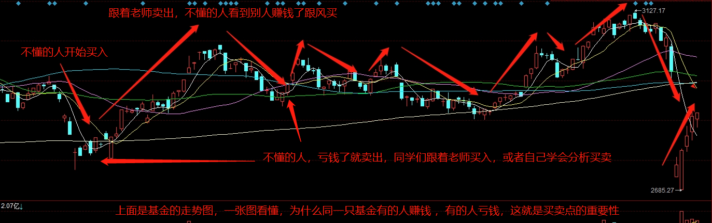
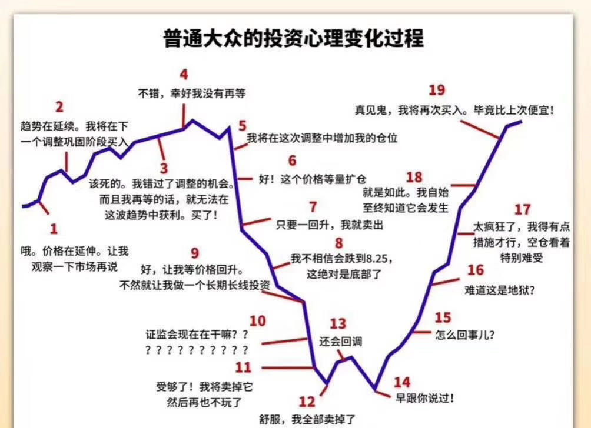
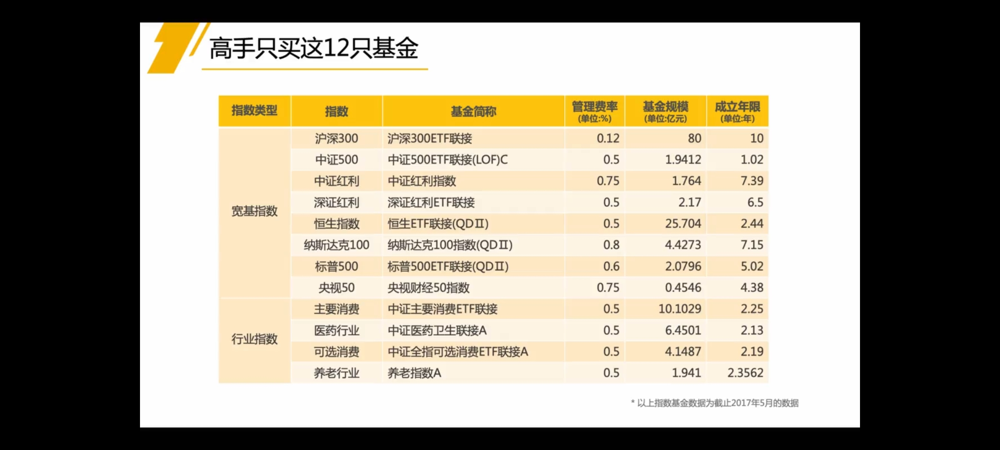
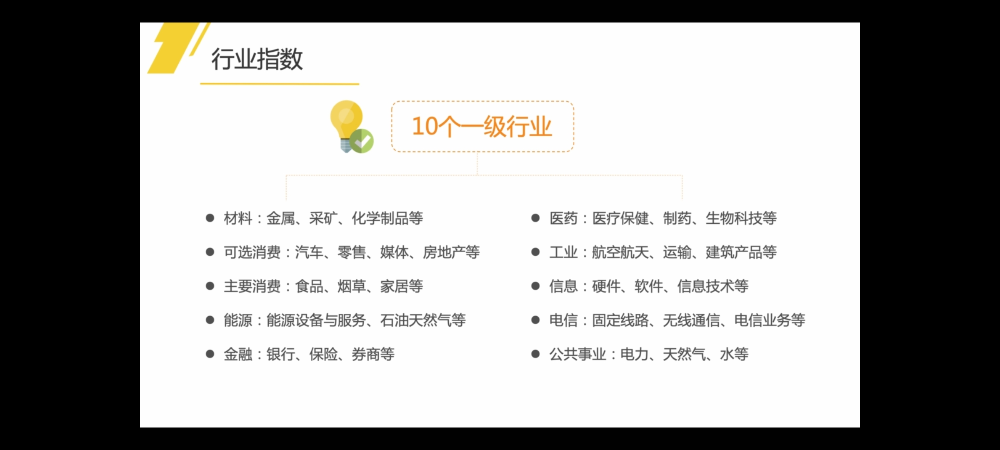
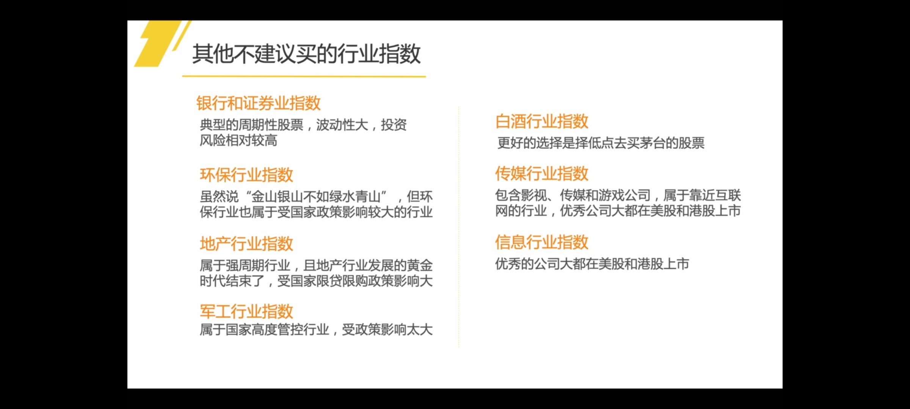
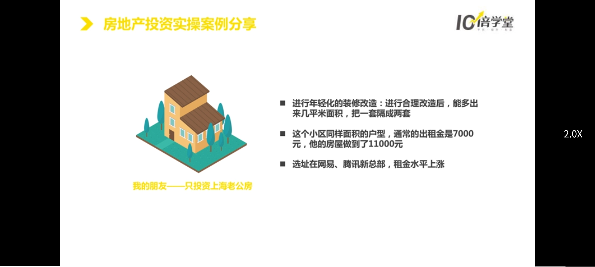
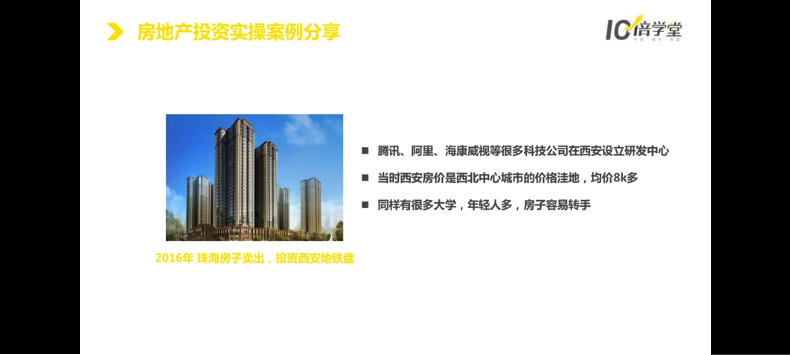
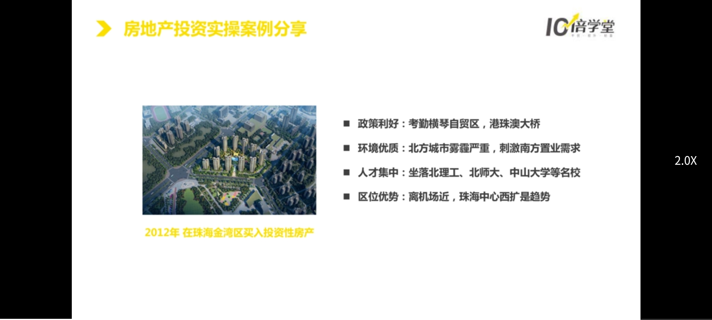

# 理财训练营
人生四象限模型：

1. 赚估值泡沫的钱。
2. 赚企业本身价值增长的钱：1. 择时；2. 断事（投资与时间为友的项目，不投资与时间为敌的项目，比如随着手机充电越来越快，共享充电宝就没有市场了；警惕跟风式的投资，不投赚辛苦钱的投资；判断一个行业一定要有终局判断，也就是行业的竞争会形成垄断、寡头、还是百花齐放；选择投资的时间点；投资前要尽可能了解赛道里的所有玩家，找到那个具有胜负手的玩家，也就是掌握关键技术的玩家。）
3. 投资项目一把手智商高的项目；价值观跟我们一致的创业者。

成为富人的秘密：分清资产和负债；善用负债（杠杆效应，利用负债来撬动更多的钱，资产负债率=总负债/总资产，如果超过50%，就很危险）；投资自己。
## 根据个人情况制定目标
### 目标A
安全舒适度过一生。

打工+业余投资。

1. 保险：下限
2. 基金：躺赢
3. 房地产：低风险、高回报、高门槛
4. 财务报表+股票投资：高情商、高智商
### 目标B
成为亿万富豪，愿意学习敢冒风险。

创业+专业投资。

1. 富人思维：决定人生的所有决策；
2. 商业系统：优秀的商业模式和系统能让你持续获利，轻松赚钱；
3. 团队：识人、用人、激励人，让别人为你赚钱。

## 股票
财务报表：读懂财务报表背后的商业信息。

股票、风险控制、精益创业（低成本、低风险、高概率）。

股票是长期回报率最高的资产。
### 投资的三个建议
1. 越早越好
2. 不能短线投资
3. 股票研究：金额<100万，年龄<40岁，不要花过多精力研究，因为回报率不高
### 三个核心理念
七亏二平一赚。
1. 股票波动大
2. 股民读不懂财报
3. 值得购买的股票不多
4. 单只股票风险大，要做组合投资
5. 买卖越频繁，越不容易赚钱

核心理念：
1. 好行业
2. 好公司
3. 好价格

看透生意的本质：迪士尼创造的卡通角色可以反复使用，爆款反复使用；华谊兄弟则明星片酬越来越高，拍摄成本高，上线电影爆款几率低
### 选股指标
ROE：净资产收益率，反映股东权益的收益水平，ROE越高说明将来收益越高，可以选择连续5年ROE>18%
### 手把手买白马股
ROE高、PE估值处于地位、公司动向、利空信息、看公司支出的费用、看对手（比如对手刚上市，上市前通常会做报表粉饰，上市后会做报表清洗，影响股价）
## 基金投资

指数基金：低风险、高回报。定投比较容易带来高收入。

资产：
1. 投资：产生现金流的资产：股票、债券、房地产的最近
2. 投机：不能产生现金流的资产、必须有人接盘：黄金、比特币、古董等。

指数基金推荐：沪深300

1. 基金分为主动基金和被动基金（指数基金），指数基金曾被股神巴菲特设赌，最终，指数基金获利极大的胜利；
2. 指数基金的特点为：灭绝人性、长生不老、永远上涨，买指数就是买国运；
3. 定投指数基金要选择微笑曲线，而决定何时入场，就得学会估值；
4. 相同本金及相同定投的情况下，每年投资收益与人相差5%，在复利的作用下，30年后的差距可能相关近千万。
### 基金定投，不止损，也要止盈
股市是周期性牛熊转换的。所以到达盈利点，就要抛出。一般定投周期是三到五年，前期亏损也不怕，一旦到了牛市的高点，或者到达止盈线，就要抛出了。如果股市下跌，就可以加大定投的金额。
### 《不上班 也有钱》
4%法则，是麻省理工学院的学者威廉班根在1994年提出的理论：“通过投资股票资产，每年从退休金中提取不超过4.2%的金额用来支付生活所需，那到自己去世，退休金都花不完的。因为股票资产自己会增值。” 一定要注意，这是美国的法则，不完全适用于中国，只是给大家一个参考。

10个提前退休的小秘诀和七步规划财务自由的方法：
1.  立刻开始存钱。哪怕是小钱。
2.  设立一个大目标。有目标才有动力。（还记得小狗钱钱吗，也有详细说过这一点）
3.  享受不用随着收入升级。
4.  不关注涨跌、股评。
5.  学着骑自行车或公共交通上下班。
6.  在家做菜。
7.  别把黄金岁月献给房贷。他们始终没有买房，都是租房。出去旅游就把房子给退了。
8.  建立共同兴趣的朋友圈。跟有同样价值观的人交往。
9.  培养有益身心的兴趣。
10.  心动就马上采取行动，凡事不要永远只是停留在“想”。

然后呢，作者还给出了“七步规划财务自由”：
1. 第一步：记账。
知道自己每一块钱花在哪里。我也反复强调了有没有？我自己也是受益者。
2. 第二步：推算财务自由需要多少钱。作者用的是4%法则。比如说每年需要10万，那就是10/4%＝250万，需要250万的资金来实现财务自由。我自己还没有算过，不确定是否适合中国国情。大家可以自己算一算，量化思维、目标导向嘛。
3. 第三步：至少存下50%的收入。（作者达到了70%-90%）
4. 第四步：减少三大支出。也就是减少房租房贷、伙食费、交通费。
5. 第五步：认清必要、需要和想要。这也是我们在强调的。
6. 第六步：长期稳健的投资。寻找稳健的投资方法，例如定投指数基金。
7. 第七步：设法增加收入。
### 建议

挑选基金的标准：
1. 跟踪误差小、规模大、历史久、费率低。
2. 优先选择场外基金，交易费用低，更容易卖。
#### 宽基指数
沪深300、中证500、红利指数（高股息率，熊市时更有优势，提供分红：上证红利、**深证红利** 、**中证红利** 、红利机会）、央视50、恒生指数、纳斯达克指数、标普500指数
#### 行业指数
主要消费（上证消费指数、上证消费80指数、**中证消费指数** 、全指消费指数）、医药行业（**中证医药指数** 、中证医药100指数、上证医药指数、全指医药指数、细分医药指数、300医药指数、500医药指数）、可选消费行业（有钱的时候才会消费）、混合（养老行业：中证养老产业指数）
## 复利
钱生钱、利滚利。

复利=本金×回报率×时间。

减少消费、避免奢侈品和炫耀性消费，合理性消费和生活。

控制风险，单只股票持仓不超过30%。

### 生活
职业选择：选择计息期更长，回报率更高的职业。

重视身体健康和家庭教育。
## 房产
注意政策风向。

量力而行，不要借高利贷。买房是为了让生活更好，而不是降低生活质量。

买房地点：未来会快速发展的城市，比如一线城市、准一线城市、二线城市；跟着国家政策买如粤港澳大湾区；靠近经济中心、政治中心的地区，除非交通特别好，否则不要买；不要买养老房和度假房，投入多，升值潜力低，景区定居的人少，难出售，捆绑了假期旅游的选择。

逆向投资：因周期性行业，销售中心门可罗雀时，可考虑买房。

### 新房、二手房交接时的验收内容和注意事项
#### 新房
房屋交接有两年的保修期，刚交接时发现问题，比较容易维修。

1. 测量面积和高度
2. 检查墙体是否空鼓或者开裂，特别是卫生间和厨房
3. 验收防水是否合格
4. 检查下水道是否通畅，施工过程中可能存在垃圾
5. 检查门窗开合
6. 检查烟道和电路等细节，可以用烟在烟道口点燃，看烟是否会飘走
7. 如果是精装修的房屋，要核对设施和电器是否和合同一致
#### 二手房
1. 验收户口和各项欠费问题
2. 拿到房本以后，及时将自己的户口迁进去
3. 检查是否拖欠物业费、供暖费、水电燃气费
## 信用卡、花呗等
信用卡的好处：提高征信，可以提供隐形财富。有钱人都会贷款。
1. 商家活动多
2. 提高资金利用率
3. 取现，免于向朋友借钱
4. 账务清晰，有账单
5. 出行便利，国外旅游方便

银行是靠存贷利差盈利，通过大量现金盈利，利用信用卡免息，是翻身途径。
## 财富梦想
1. 财务安全：投资收益足以支付生活基本开销
2. 财务活力：在上一等级上添加一点奢侈性支出
3. 财务独立：不需要工作，就能维持当前的生活方式
4. 财务自由：通过被动收入实现奢侈品如买房、车、旅游等
5. 绝对财务自由：想买到的都能买到，开始考虑个人对社会的价值
