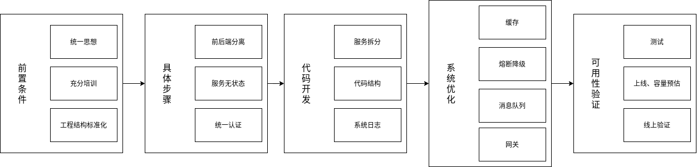
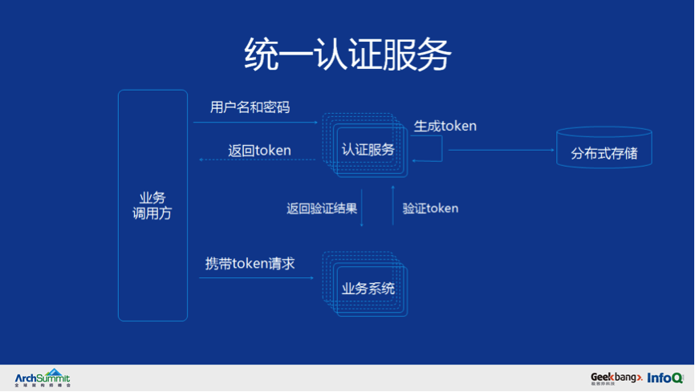
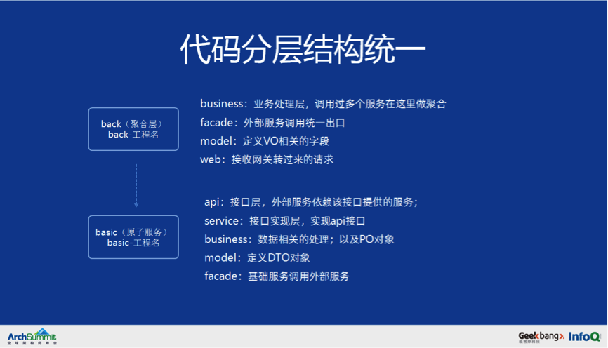
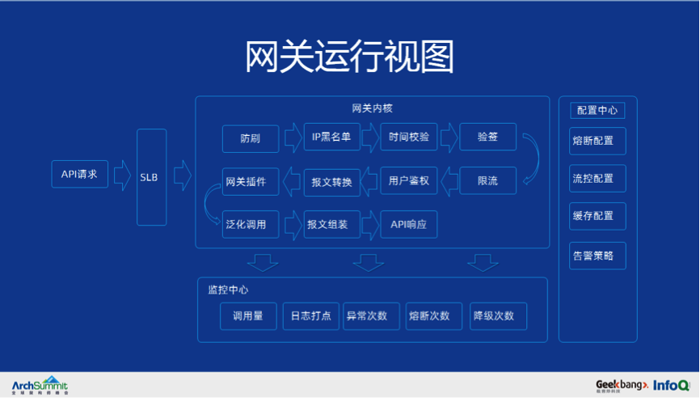
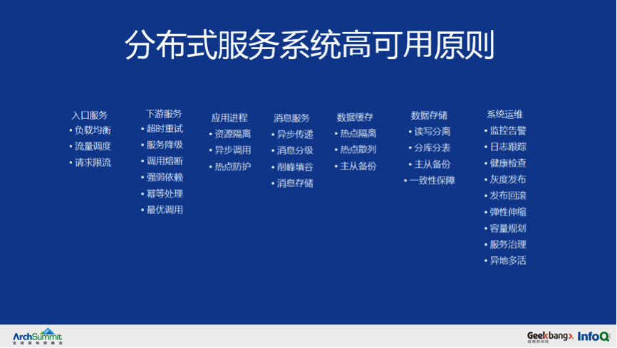
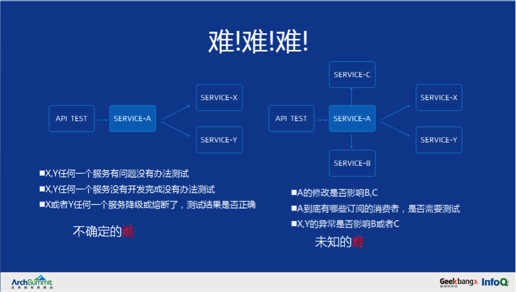
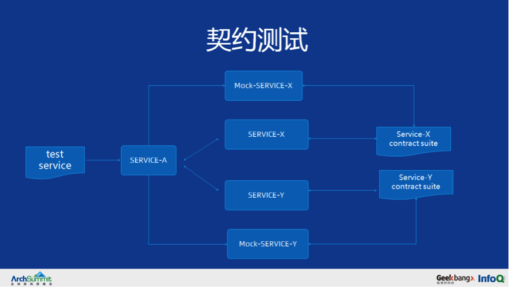
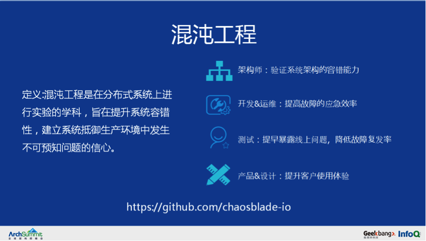
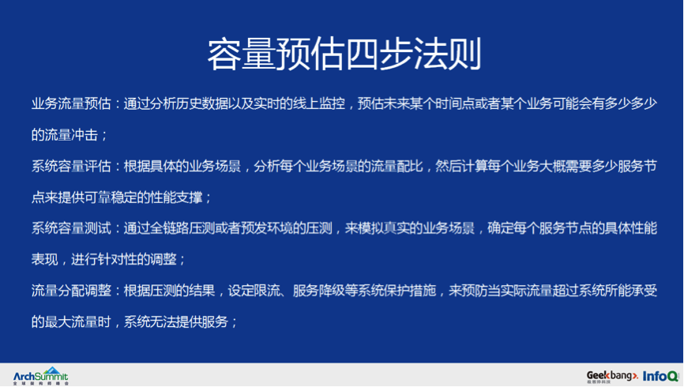

# 从 0 到千万级用户亿级请求微服务架构历程
  
## 前置条件
**切实需要使用微服务来解决实际问题；组织结构思想认知一致；前期有完善系统性针对微服务的培训。**

* **统一思想**：实施微服务，不可避免的涉及到组织结构的调整以及后续人力资源的增补，新架构上线也难免遇到问题，因此需要获得高层的认可；
* **充分培训**：三种特质：精、气、神。  
  精：熟悉业务和框架，熟悉原理、源码  
  气：对微服务架构思想认知一致  
  神：了解理论知识：如服务治理、服务自治、知其然而知其所以然
* **工程结构标准化**：  
  基准代码：一份基准代码，多份部署(生产环境、预发环境、测试环境、开发环境)  
  依赖：显式声明依赖关系  
  配置：在环境中存储配置  
  后端服务：把后端服务当做附加资源  
  构建、发布、运行：严格分离构建和运行  
  进程：以一个或多个无状态进程运行应用  
  端口绑定：通过端口绑定来提供服务  
  并发：通过进程模型进行扩展  
  易处理：快速启动和优雅终止可最大化健壮性  
  环境等价：开发环境与线上环境等价  
  日志  
  管理进程

### 测试即交付原则
测试的软件制品和交付到生产的软件制品是一样的。**重点强调环境配置和制品库分离**，如果是测试环境的配置，那么软件运行起来就是测试环境，如果是生产环境的配置，那么软件运行起来就是生产环境。  

错误示例：把配置文件写到工程里面，例如 application-dev.properties、application-test.properties、application-prod.properties 等，然后在系统启动的时候增加 spring.profiles.active=dev 来说明环境。首先违背了云原生 12 要素第一个条件，其次测试环境、生成环境的所有的配置信息都暴露在代码中，容易导致信息泄露，最后增加运维部署难度，一旦环境变量标识错误就会导致软件运行失败。  

## 具体步骤
微服务的实施并非仅仅使用 Dubbo 或者 SpringCloud 把系统内部接口调用换成 RPC 或者 Rest 调用。实际上完整的去实施微服务必须从全局考虑统一规划，包括前后端分离，服务无状态、统一认证以及运维体系的调整等。
* **前后端分离**：前端和后端的代码分离，前端负责 HTML 页面的编写以及逻辑跳转，后端负责提供数据接口给前端，前后端开发人员可以并行开发。  
  前端对跳转逻辑和 UI 交互负责，后端对接口的高可用负责。  
  前端 html 层使用 VUE 框架，node.js 可以起到逻辑跳转的控制，前后端通信采用 rest 方式，json 数据格式通信。  
  优点总结：
* * 各端的专家来对各自的领域进行优化，以满足用户体验优化效果最优化；
* * 前后端交互界面更加清晰，采用接口方式通信，后端的接口简洁明了，更容易维护；
* * 前端多渠道集成场景更容易扩展，采用统一的数据和模型，可以支撑前端的 web UI\ 移动 App 等访问，后端服务不需要改动。
* **服务无状态**：该服务运行的实例不会在本地存执行有状态的存储，例如不存储需要持久化的数据，不存储业务上下文信息，并且多个副本对于同一个请求响应的结果是完全一致的，一般业务逻辑处理都被会定义为无状态服务。
* **统一认证**：统一认证与授权是开始实施服务化的最基础条件，也是最基础的一项应用。由于服务无状态，需要统一认证服务来完成认证鉴全以及和第三方联合登录，使用token机制来做统一认证的主要流程如下：  
* * 用户输入用户名和密码提交给认证服务鉴权；
* * 认证服务验证通过后生成 token 存入分布式存储；
* * 把生成的 token 返回给调用方；
* * 调用方每次请求中携带 token，业务系统拿到 token 请求认证服务；
* * 认证服务通过后业务系统处理业务逻辑并返回最终结果。

## 代码开发
### 服务拆分
服务拆分通常根据架构师经验以及业务形态和用户规模等综合考虑，实践中遇到以下两种服务拆分的模式：
* **一个方法一个服务**：视业务规模和业务场景而定；
* **基于代码行数的划分**：简单粗暴，不推荐。

按方法拆分服务太过于细致，应该要按业务功能来拆。其实当业务达到一定规模的时候，按方法拆分是一种非常有效的做法，以用户服务举例，在初始阶段的时候，用户服务具备了用户的增删改查功能，当用户规模上升之后需要对增删改查功能做优先级划分。在互联网中流量获客是最贵的，运营团队通过互联网投放广告获客，用户在广告页上填写手机号码执行注册过程，如果此时注册失败或者注册过程响应时间过长，那么这个客户就可能流失了，但是广告的点击费用产生了，无形中形成了资源的浪费。所以此时需要按方法维度来拆分服务，把用户服务拆分为用户注册服务（只有注册功能），用户基础服务（修改、查询用户信息）。

服务拆分时的团队人数规模通常遵循2个披萨原则和康威定律：
* **两个披萨原则**：如果两个披萨不足以喂饱一个项目团队，那么这个团队可能就显得太大了，所以一个服务的人数划分为 5-7 人比较合适。因为人数过多的项目将不利于决策的形成，而让一个小团队在一起做项目、开会讨论，则更有利于达成共识，并能够有效促进企业内部的创新。
* **康威定律**：你想要架构成为什么样，就将团队分成怎样的结构。比如前后端分离的团队，架构就是基于前后端分离。在基于微服务设计的团队里，一个很好的理念是自管理，团队内部对于自己所负责的模块高度负责，进行端对端的开发以及运维。

**服务划分的方法论**：当一块业务不依赖或极少依赖其它服务，有独立的业务语义，为超过 2 个或以上的其他服务或客户端提供数据，应该被拆分成一个独立的服务模，而且拆分的服务要具备高内聚低耦合。

**服务拆分模式**：业务功能分解模式和数据库模式。

**业务功能分解模式**：判断一个服务拆分的好坏，就看微服务拆分完成后是否具备服务的自治原则，如果把复杂单体应用改造成一个一个松耦合式微服务，那么按照业务功能进行分解是最简单的，只需把业务功能相似的模块聚集在一起。

微服务初始阶段服务拆分不需要太细，等到业务发展起来后可以再根据子域方式来拆分，把独立的服务再拆分成更小的服务，最后到接口级别服务。如果服务拆分的过小会导致调用链过长，以及引发没有必要的分布式事务，此时阶段性的合并非常重要。做为架构师不仅要学会拆分服务，也需要学会合并服务，需要周期性的去把拆分过小或者拆分不合理的服务要及时合并。

在服务拆分的时候需要抓住以下重点：
* 高内聚的拆分模式
* 以业务为模块拆分
* 以迭代频率和改动范围拆分
* 阶段性合并
* 定期复盘总结

### 代码结构
当一个单体应用被划分为 N 多个服务的时候，每个服务启动方式，代码层次各不相同，如何去维护呢？所以微服务启动阶段，首先要做的事情就是**工程结构标准化和自动化**，让研发人员的重点精力去做业务，而不是去搭建框架。

因此基于 velocity 自定义了一套微服务代码自动生成框架，研发人员设计好表结构之后，框架根据表结构自动生成服务代码，包含 API 接口，实现类，DAO 层以及 Mybatis 的配置文件，类的名称，包名、module 名称都有严格的定义。

为了让研发效率更快，架构更清晰，又从架构层面把代码再拆分为聚合服务层和原子服务层。
* 聚合层：收到终端请求后，聚合多个原子服务数据，按接口要求把聚合后的数据返回给终端，需要注意点是聚合层不会和数据库交互；
* 原子服务层：数据库交互，实现数据的增删改查，结合缓存和工具保障服务的高响应；要遵循单表原则，禁止 2 张以上的表做 join 查询，如有分库分表，那么对外要屏蔽具体规则。

  

### 系统日志
日志记录的详细程度直接关系到系统在出现问题时定位的速度, 同时也可以通过对记录日志观察和分析统计，提前发现系统可能的风险，避免线上事故的发生。  

在实施微服务的之前，必须要先确定日志的规范，为了便于后面的日志采集、处理和分析。例如统一约定日志格式如下：
* 时间|事件名称|traceID|耗时时间|用户 ID|设备唯一标识|设备类型|App 版本|访问 IP|自定义参数
* 时间：日志产生时候系统的当前时间，格式为 YYYY-MM-DD HH:MM:SS；
* 事件名称：预先定义好的枚举值，例如 Login、Logout、search 等；
* TraceID：当前请求的唯一标识符；
* 耗时时间：当前事件执行完成所消耗的时间；
* 用户 ID：当前登陆用户的唯一 ID，非登陆用户为空；
* 设备唯一标识：当前设备的唯一标识，假如某用户登录前开始操作 App，这个时间记录下设置唯一标识后，可以通该标识关联到具体用户；
* 设备类型：当前设备的类型，如 Android 或者 iOS；
* App 版本：当前访问设置的 App 版本号；
* 访问 IP：当前设备所在 IP 地址；
* 自定义参数用：自定义参数，参数之间使用 & 分割，例如 pid=108&ptag=65

工程结构、代码框架和日志在开发过程中最容易被忽略的，但却非常的重要，前期合理的规划有助于规模化推广的时候减轻压力，在规划阶段要重点关注以下内容：
* 代码未编工具先行；
* 统一微服务工程结构；
* 统一服务启动方式（jar war）；
* 统一缓存调用方式（架构封装统一提供 jar 包和底层存储无关）；
* 统一 MQ 调用方式（架构封装统一提供 jar，和具体 MQ 类型无关) ；
* 统一日志格式；
* 统一多服务依赖调用方式 (串行调用方式、并行调用方式）；
* 统一熔断、降级处理流程；

## 系统优化
### 缓存
* **缓存穿透**：是指查询一个一定不存在缓存 key，由于缓存是未命中的时候需要从数据库查询，正常情况下查不到数据则不写入缓存，就会导致这个不存在的数据每次请求都要到数据库去查询，造成缓存穿透, 有 2 个方案可以解决缓存穿透：
* * 方案 1：可以使用布隆过滤器方案，系统启动的时候将所有存在的数据哈希到一个足够大的 bitmap 中，当一个一定不存在的数据请求的时候，会被这个 bitmap 拦截掉，从而避免了对底层数据库的查询压力
* * 方案 2：返回空值：如果一个查询请求查询数据库后返回的数据为空（不管是数据不存在，还是系统故障)，仍然把这个空结果进行缓存，但它的过期时间会很短，比如 1 分钟，但是这种方法解决不够彻底。
* **缓存击穿**：缓存 key 在某个时间点过期的时候，刚好在这个时间点对这个 Key 有大量的并发请求过来，请求命中缓存失败后会通过 DB 加载数据并回写到缓存，这个时候大并发的请求可能会瞬间把后端 DB 压垮，解决方案也很简单通过加锁的方式读取数据，同时写入缓存。
* **缓存雪崩**：是指在设置缓存时使用了相同的过期时间，导致缓存在某一时刻同时失效，所有的查询都请求到数据库上，导致应用系统产生各种故障，这样情况称之为缓存雪崩，可以通过限流的方式来限制请求数据库的次数。

即使使用了缓存，偶尔还是可能出现超时问题，所以需要把串行调用调整为并行调用：
- 线程池并行调用： 为了提高接口响应时间，把之前串行调用方式修改为把请求封装为各种 Future 放入线程池并行调用，最后通过 Future 的 get 方法拿到结果。这种方式暂时解决了详情页访问速度的问题，但是运行一段时间后发现在并发量大的时候整个聚合层服务的 Tomcat 线程池全部消耗完，出现假死的现象。
- 服务隔离并行调用： 由于所有调用外部服务请求都在同一个线程池里面，所以任何一个服务响应慢就会导致 Tomcat 线程池不能及时释放，高并发情况下出现假死现象。为解决这个问题，需要把调用外部每个服务独立成每个线程池，线程池满之后直接抛出异常，程序中增加各种异常判断，来解决因为个别服务慢导致的服务假死。
- 线程隔离服务降级： 方式 2 似乎解决了问题，但是并没有解决根本问题。响应慢的服务仍然接收到大量请求，最终把基础服务压垮，需要判断当服务异常超过一定次数之后，就直接返回设置好的返回值，而不用去调用 RPC 接口。这时候程序中存在大量判断异常的代码，判断分支太多，考虑不完善接口就会出差。

### 熔断降级
服务化拆分之后，系统中原有的本地调用就会变成远程调用，这样就引入了更多的复杂性。可以引入 **Hystrix** 或 **Sentinel** 做服务熔断和降级；需要针对如下几项做了个性化配置：
* 错误率：可以设置每个服务错误率到达制定范围后开始熔断或降级；
* 人工干预：可以人工手动干预，主动触发降级服务；
* 时间窗口：可配置化来设置熔断或者降级触发的统计时间窗口；
* 主动告警：当接口熔断之后，需要主动触发短信告知当前熔断的接口信息。

### 消息队列
虽然服务拆分已经解决了模块之间的耦合，大量的 RPC 调用依然存在高度的耦合，不管是串行调用还是并行调用，都需要把所依赖的服务全部调用一次。但是有些场景不需要同步给出结果的，可以引入 MQ 来降低服务调用之间的耦合。

例如用户完成注册动作后需要调用优惠券服务发放优惠券，在调用积分服务发放积分，还需要初始化财务模块，再计算营销活动，最后需要把本次注册信息上报给信息流，这种做法带来了 2 个问题，第一个问题是整个注册链路太长，容易发生失败，第二个问题，任何依赖用户注册行为的服务都需要修改服务注册接口。

使用MQ解耦就变得简单了，只需要往 MQ 发送一个注册的通知消息，下游业务如需要依赖注册相关的数据，只需要订阅注册消息的 topic 即可，从而实现了业务的解耦。使用 MQ 的好处包括以下几点：
* 解耦：用户注册服务只需要关注注册相关的逻辑，简化了用户注册的流程；
* 可靠投递：消息投递由 MQ 来保障，无需程序来保障必须调用成功；
* 流量削峰：大流量的新用户注册，只需要新增用户服务，并发流量由 MQ 来做缓冲，消费方通过消费 MQ 来完成业务逻辑；
* 异步通信（支持同步）：由于消息只需要进入 MQ 即可，完成同步转异步的操作；
* 提高系统吞吐、健壮性：调用链减少了，系统的健壮性和吞吐量提高了；

日常开发中，对于 MQ 做了如下约定：
* 应用层必须支持消息幂等
* 支持消息回溯
* 支持消息重放
* 消息的消费的机器 IP 以及消息时间

### 网关
仅仅使用缓存、并行调用、消息队列，系统的稳定性已经提升了不少，但由于每周上线的功能逐步增多，每个业务都会需要鉴权、限流、验签等逻辑，需要每个聚合服务都需要根据规则自己实现一遍，权限认证每个模块各自处理，状态码各种各样；且许多人围着运维修改Nginx的配置，开发遇到了新的瓶颈：
* 上线新接口需要运维在 Nginx 中配置
* 接口复用性不高
* 权限认证每个模块各自处理，状态码各种各样
* 限流熔断降级各自处理
* 开发效率不高
* 接口文档没有最新的，谁负责的接口无人知道

因此使用Netty框架和Dubbo泛化功能自研了网关，集成了用户权限认证、限流、熔断降级等功能，让业务开发人员只关心业务实现，而无需关注非业务。

网关可以理解为一个反向路由，它屏蔽内部细节，为调用者提供统一入口，接收所有调用者请求，通过路由机制转发到服务实例，同时网关也是“过滤器”集合，可以实现一系列与业务无关的横切面功能，如安全认证、限流熔断、日志监控，同时网关还有如下特性：
- **协议转换**： 将不同的协议转换成“通用协议”，然后再将通用协议转化成本地系统能够识别的协议，例如把 HTTP 协议统一转换为 Dubbo 协议。
- **链式处理**： 消息从第一个插件流入，从最后一个插件流出，每个步骤的插件对经过的消息进行处理，整个过程形成了一个链条。优势在于它将处理请求和处理步骤分开，每个处理的插件，只关心这个插件上需要做的处理操作，处理步骤和逻辑顺序由“链”来完成。
- **异步请求**： 所有的请求都会通过 API 网关访问应用服务，无论业务量如何变化，网关的吞吐量要保持稳定状态。

在架构层面把网关分为接入层、分发层和监控层，网关和后端服务通信使用 Dubbo 的泛化方式，负载均衡也直接使用 Dubbo 默认的随机策略。

- 接入层：负责接收客户端请求，调度、加载和执行组件，把非法请求拦截在系统之外；
- 分发层：将请求路由到上游服务端，并处理其返回的结果；
- 监控层：监控日志、生成各种运维管理报表、自动告警等；

管理和监控系统主要是为核心系统服务的，起到支撑的作用。

在通信协议上前端和网关交互采用 HTTP 方式，数据格式是 JSON 格式，并定义了一套网关接口规范，前端只需要根据接口协议封装好报文就可以了。

在 Dubbo 的泛化调用的时候，需要方法名、参数类型以及具体的值 Object result = genericService.$invoke(“方法名”, new Object []{“参数类型”}, new Object[]{“具体值”})，但是在前后端的接口协议中并没有看到参数类型，其主要原因是为了安全，在接口配置过程中会把 apiId 对应的方法名称、参数类型写入数据库，网关启动后这些配置都会加载到本地缓存，运行过程中可通过 ACQ002 找到具体的配置信息，并完成泛化调用。

总结：
- 网关让服务具有可复用性；
- 多个服务调用尽可能并行化调用；
- 本地缓存 + 远程缓存完美搭配，提供统一调用方式；
- 服务高可用熔断降级必不可少，但是参数配置需要清晰；
- MQ 的解耦和消峰功能是微服务有效搭配。

## 可用性验证
### 测试
当我们在谈服务的高可用性的时候，一般会从流量入口分流策略、下游服务调用、应用进程、消息服务、数据缓存、数据存储以及系统运维策略等 7 个维度综合来考虑。这其中涉及到开发、测试、运维等多种角色。尤其是针对测试人员而言，这些保障系统高可用的措施能否测试全面？以熔断测试和降级测试举例：

* **熔断测试**：从服务的性能角度，当系统负载达到某个熔断状态的时候，服务是否能正确熔断；同时，从功能角度验证熔断后系统的行为是否跟预期相符；
* **降级测试**：从业务的稳定性角度，要能区分出核心业务和非核心业务，在需要降级的时候不能影响核心业务；当某个服务降级后，从功能角度验证系统行为是否跟预期相符。

虽然熔断、降级在架构设计阶段就规划到系统中，但是这种业务场景在测试阶段如何去验证呢？

微服务测试之难：

#### 契约测试
契约测试 ，又称之为消费者驱动的契约测试 (Consumer-Driven Contracts，简称 CDC)，契约测试最开始的概念由 Martin Fowler 提出，根据消费者驱动契约，可以将服务分为消费者端和生产者端，而消费者驱动的契约测试的核心思想在于是从消费者业务实现的角度出发，由消费者自己来定义需要的数据格式以及交互细节，并驱动生成一份契约文件。然后生产者则根据契约文件来实现自己的逻辑，并在持续集成环境中持续验证。契约测试核心原则是以消费者提出接口契约，交由服务提供方实现，并以测试用例对契约结果进行约束，所以服务提供方在满足测试用例的情况下可以自行更改接口或架构实现而不影响消费者。

契约测试总体流程说明如下：Consumer 端请求 Provider 的之前，会先执行 ContractTestFilter ，使用 HTTPPost 方式是发送一个 JSON 数据格式的 post 请求，包含 interfaceName、methodName、arguments 发送到契约测试平台，测试平台根据传递参数组合成查询条件来查询该接口是否启用了契约测试。如果启用了契约测试，则直接返回设定的返回值，否则返回 false，Consumer 根据返回的结果再去调用 Provider 所提供的服务，把具体结果返回给调用方，同时再把返回结果和入参封装成 JSON 数据格式发送到契约测试平台，完成接口数据采集。

#### 混沌工程
随着注册用户量的逐步增多，平台所提供多元化且丰富功能以及运营使用了有效的用户触达机制，用户活跃度上升非常快，此时平台的稳定性越来越重要。虽然我们在架构层面做了熔断、降级、多级缓存等措施，但是在过去的一段时间里还是发生了几次大的线上故障，我们也针对这些事故做了详细的复盘分析，出现事故的原因包括：磁盘写满、CPU 打满、服务响应慢甚至超时、数据库响应慢等等，分析过程中发现架构中虽然包括了熔断、降级等手段，但是当事故发生的时候似乎这些机制都没有生效。比如磁盘写满、CPU 打满等故障在设计阶段根本未考虑到，服务响应慢或者超时这个现象研发虽然可以通过硬编码在开发阶段来模拟，但是迭代正式提测后，测试是否需要测试架构中的熔断降级策略呢？如果需要测试那谁来协助测试模拟各种异常情况？

为了解决这个难题，我们参考了互联网公司的通用方法，通过模拟调用延迟、服务不可用、机器资源满载等，查看发生故障的节点或实例是否被自动隔离、下线，流量调度是否正确，预案是否有效，同时观察系统整体的 QPS 或 RT 是否受影响。在此基础上可以缓慢增加故障节点范围，验证上游服务限流降级、熔断等是否有效。通过模拟故障节点增加到请求服务超时，估算系统容错红线，衡量系统容错能力在生产环境的分布式系统中进行一些试验，用以考验系统在动荡环境下的健壮性，从而增强对系统稳定运行的信心，称之为**混沌工程**，ChaosBlade 是阿里巴巴开源的一款遵循混沌工程实验原理，提供丰富故障场景实现，帮助分布式系统提升容错性和可恢复性的混沌工程工具。

要进行的实验或验证包括：
1. 业务功能
2. 监控告警
3. 失败重试
4. 降级熔断
5. 异常隔离
6. 流量调度
7. 编排部署
8. 水平扩容

例如需要做一次针对数据库慢 SQL 对业务影响范围的试验，可以按照以下方式来执行：
* 设定场景：数据库调用延迟
* 监控指标：慢 SQL 数，告警信息
* 期望假设：慢 SQL 数增加，钉钉群收到慢 SQL 告警
* 混沌实验：对 user-provider 注入调用 user 数据库延迟故障
* 监控指标：慢 SQL 数增加，钉钉群收到告警，符合预期

在测试阶段需要注意以下内容：

* 测试人员思想的改变，接口有数据返回不一定就是正确的
* 丢弃 E2E 的思想，更多的去看服务和接口
* 想要线上稳定，混沌工程必须动起来
* 线上的事故或者 Bug 必须要定期复盘和总结
### 上线、容量预估
需要科学而又严谨的评估，通过评估结果来确定需要的资源数量。在容量评估之前我们需要先了解下网站访问量的常用衡量标准：

* UV：独立访客；
* PV：综合浏览量；
* 并发量：系统同时处理的请求数；
* 响应时间：一般取平均响应时间；
* QPS：每秒钟处理的请求数，QPS = 并发量 / 平均响应时间；
* 带宽：PV / 统计时间（换算到秒）平均页面大小（单位 KB）* 8

估算容量时要注意一些法则：

### 线上监控
遵循“谁构建，谁运维”这一理念，服务上线只是完成了构建的环节，更重要的是线上的运维和监控，需要提供服务状态上报的机制。

服务监控：

* QPS
* 错误返回数
* 接口请求次数的 top
* 接口 95th，99th 请求时间 top
* JVM 堆内存 / 非堆内存
* JVM 线程数
* GC 的暂停时间和次数
* Tomcat 的活跃线程
* API 自己上报的业务数据

数据库监控：
* 数据库连接数
* 数据库 CPU
* 慢 SQL
* 全表扫描 SQL

硬件监控：
* CPU 使用率和负载
* 磁盘空间
* 网络流量

## 微服务实施总结
* 实施微服务有难度，如非必须，不要轻易使用微服务；
* 微服务的目的是解决研发的矛盾以及企业规划相关，不要为了微服务而微服务；
* 思想认知一致，充分的沟通和培训是必不可少的；
* 所有微服务都是不可信赖的；
* 监控、监控、监控一切可监控的内容。
## 原文
https://www.infoq.cn/article/BVITbB8kOGSjK2GimDLW
