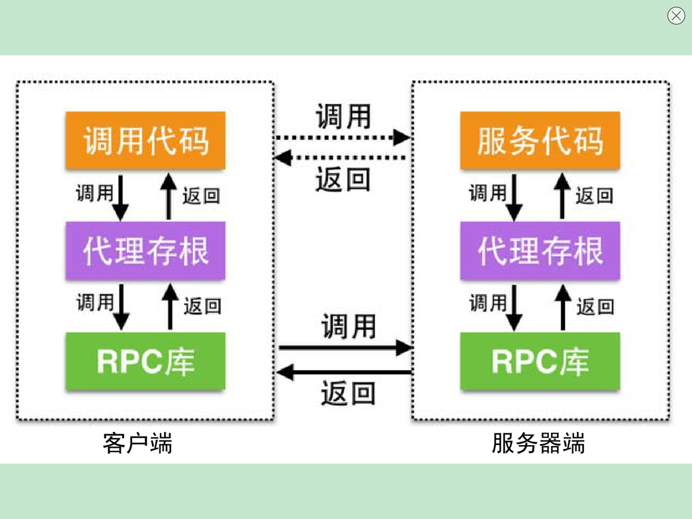

# 通信机制
## 同步通信与异步通信
同步通信：客户端发出请求后，客户端等待直到获得响应。  
异步通信：客户端发送请求，不需要等待，服务端会在完成后主动通知客户端。
### 远程调用RPC

1. 客户端调用本地代理存根，发送请求到服务器端，等待应答信息。
2. 服务器端的服务代理睡眠直到客户端请求到达并唤醒。
3. 服务代理获得请求参数后，交由服务器端的服务代码对其进行处理。
4. 应用程序处理结束后，由服务代理向客户端发送应答，等待下一次请求。
5. 客户端代理存根接收应答信息，交给客户端的调用代码进行处理。

RPC的弊端在于耦合度高，依赖于编程语言或特定平台，且灵活性差，传输格式是二进制数据，需要客户端和服务端保持一致。
### REST
REST（Representational State Transfet，表述性状态传递），从语义层面将响应结果定义为资源，并使用HTTP的标准动词映射为对资源的操作，形成了一种以资源为核心、以HTTP为操作方式的，与语言无关、平台无关的服务间的通信机制。
#### REST的核心
1. 资源：对某类信息实体的抽象
2. 表述：对资源在某个特定时刻的状态的描述
3. 状态转移：指客户端同服务器端交互的过程中，客户端能够通过资源的表述，实现操作资源的目的
4. 统一接口：客户端操作资源的方式，通常是基于HTTP的4个动词，GET获取、POST新建、PUT更新、DELETE删除。

优势在于以资源为核心，与语言、平台都无关的通信机制。不足则在于标准化资源结构复杂，处理相关的链接也复杂，需要提供接口文档列表，否则难以理解如何使用。
### HAL
轻量级超文本应用描述协议，HAL的实现基于REST，有效地解决了REST中资源结构标准化和如何有效定义资源链接的问题。HAL和REST不同之处在于，HAL将资源分为了状态（资源本身固有的属性）、链接（与当前资源相关的一组资源的链接集合）、子资源（在当前资源的内部，嵌套资源的定义）三个部分。
### 消息队列
核心：  
1. 持久性：消息可以保存在内存中、写入到磁盘中或提交到数据库
2. 排队标准：指定相应的标准和算法，保障消息进入或者出队列的优先级
3. 安全策略：提供特定的安全策略，决定哪些接收者能够访问或者获取消息
4. 清理策略：为处理过的消息提供清理策略，保障消息的有效清理机制
5. 处理通知：提供某种通知机制，帮助消息发布者直到何时部分或全部接收者接收到了消息

访问方式：  
1. 拉模式：pull，消费者定期检查队列上的消息
2. 推模式：push，通过某种机制通知消费者

优点：  
1. 服务间解耦
2. 异步通信
3. 消息的持久化以及恢复支持

缺点：  
1. 实现复杂度增加
2. 平台或者协议依赖
3. 维护成本高

### 后台任务处理系统
如Resque、Sidekiq或Delayed_job等。

后台任务处理系统主要包括：任务、队列、执行器、定时器等部分。
