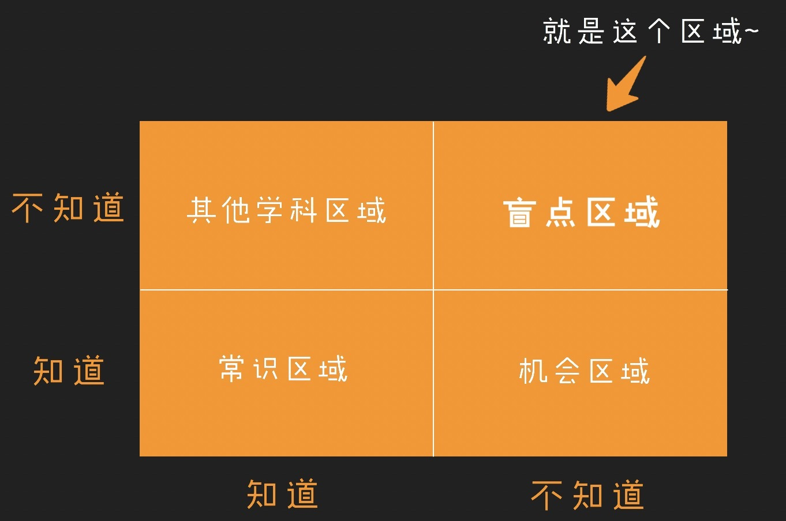
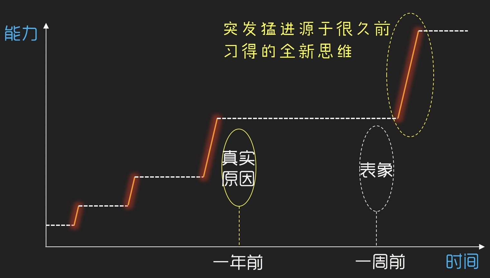

# 人生道理
永远不要认为我们可以逃避，我们的每一步都决定着最后结局，我们的脚正在走向自己选定的终点。

当下每一次想要努力的念头，都有可能是未来的你，在向现在的你求救。

若批评不自由，则赞美无意义。

1. 轻易能让你爽的事情，最后都容易让你痛苦。
2. 花费很大精力让自己变美的女生，一开始就输了——输在气质。
3. 成年人的世界里，不怕此时此刻的讨厌嫌弃，就怕无时无刻的笑脸相迎。
4. 人只有在自由时间里才是在“活着”的：手机阻止了无聊，也阻止了无聊带来的好处。
5. 会给你讲道理的男生，比只会哄你的男生，更值得珍惜。
6. 费心费力维系的人际关系根本没有那么重要
7. 不要活成复制品。
8. 在网络上，你所接触到的一切东西，都是他人给你设计好的。
9. 人和人最大的区别在于思考的深度。
10. 随时与自己保持联系。
11. 社交本质是价值互换。
12. 知识或者技能这种东西，学到了就跟你一辈子。
13. 永远不要和不懂的人浪费时间
14. 能记住你生日的朋友，都是在乎你的人
15. 最重要的是一个“**定** ”字：当坐下来，要坐定，跟人讲话，眼神要定，不要来回飘，去公众场合，不要左看看右看看仿佛不专心。
16. 真正的独立，不是穿名牌、住高级套房、出国到处旅行，而是健康的身体、一大笔存款、不俗的认知。
17. 同一个坑，踩一次算失误，踩两次算粗心，踩三次就是傻子。
18. 永远别把75%以上的自己暴露出去。
19. 话不说死，事不做绝。待人善，办事稳，别人踩你底线时，学会笑着把他轰飞出去。
20. 再厉害的人，也没有三头六臂，把时间和精力，分配得合理妥当。
21. 对大部分人沉默倾听，与小部分人促膝长谈。
22. 想少犯错，可以管好你的全身。管好嘴，不该说的话不说，管好手，不该做的事情不做，管好腿，不该去的地方不去。等你都管好全身的每个部位，你会发现，很多的错误都会远离你。
23. 拒绝要爽快，答应要负责。
24. 不管是没做过，还是没做成的事，勇敢去尝试。
25. 喜欢你的人，不能光看Ta的嘴，还要看身体。嘴用来说话，身体用来行动，只有当言=行时，这个人才值得信赖。
26. 那些很少被鼓掌却还愿意给别人鼓掌（点赞）的人，往往很善良，在现实生活中也会收到好的回报。
27. 保持界限的关系最安全，划分界限=保持关系。
28. 深夜的情感最脆弱。
29. 成功不过是坚持到好事的发生。
30. 专注10分钟，好过分心1小时。
31. 体检不是过过流程，是保命手段。
32. 学会平衡你的工作生活，不要过度繁忙，也不要过于清闲。
33. 不要试图在一群人中寻求关注。
34. 信用是人品的照妖镜。
35. 自带认可属性的人，更受欢迎。
36. 会自我解压的人能走得更远。
37. 灌了【冷风】的话，一句也不要说。拒绝说那些伤人讽刺的话，伤人又伤心，人都是相互的，你怎么对待别人，别人也会怎么对待你，多说一些温暖的话，吃不了亏。
38. 人生中90%的焦虑，源于事情未解决或没做好。只要一些事情让你有了紧迫感和危机感，就会产生焦虑，很多摆脱不了焦虑的人，通常是问题迟迟得不到解决，问题在，焦虑就在。
39. 钱是解决大多问题的最快方式。
40. 学会一个牛逼的技能，是你升级打怪的资本。
41. 别让人习惯你的好，友好但有底线。
42. 自律是驱动人生的加速器。
43. 不要无故的指点别人。
44. 厉害的人，敢于打破能力天花板。
45. 宁愿把脏话吐在角落，也不要让它出来祸害人间。
46. 长大后我才明白，不要掉入烦恼的沼泽。
47. 成长是不断前进的旅程，总想着往回走的人，注定走不了远路。人要往前看，纠结过往没有意义，期待明天才有未来。
48. **积累很重要，量变引起质变** ，很多事情的质变需要一个契机：人们总会高估自己一年能做的事情，却往往低估自己十年能做的事情 ——比尔盖茨
49. 改变身体就是改变命运。
50. 不要等什么都准备好了再去做，立刻做，马上做：花费太多心力在前期的准备上却达不到预期的效果，会让人变得容易沮丧，不能持久，丧失动力。有太多的想法选择，也会让我们忽视眼前的重点——不是去评估机会，而是先把机会抓住。
51. 只有开放，才能专注：一旦你看到了全局，就能够回来安心做自己。
52. 找方法，创造环境，脱离环境：人的主观能动性，书本知识和思维方式不能代替你被环境所潜移默化影响的部分。找方法，创造环境，意味着要创造好的环境：譬如找一个安静的场地看书学习；借助优秀的榜样，同行者和参照物的力量。而脱离环境，是不被差的环境影响：譬如搬出宿舍，拒绝与不上进的舍友厮混。
53. 

## 人生成长高度

真正决定我们人生的高度的，都是那些**我们不知道自己不知道的事** 。
* 你知道自己知道：这些通常也是大众常识；
* 你知道自己不知道：这些通常是成熟的学科，比如你学计算机的，你清楚自己不懂医学、法学、金融
* 你不知道自己知道：这通常是机会区域，比如有些领域，你觉得很牛逼，但一旦你研究会发现，原来不难啊（即你已经具备相关思维）
* 你不知道自己不知道：这个区域我称为“盲点区”，就是你压根连去思考的机会都没有的「大坑」区域，也是我认为真正决定任何人生高度的区域。

而对于我们人生的成长，任何的速成论都是伪科学，欲速则不达。一本书（或文章）如果让你触动很大，最好读3遍。尤其强调一点：知识是无法通过简单的『记忆』获得，唯有通过我们在脑海内对知识的『重新创造』才能让你『掌握』某一领域的知识（能够进行灵活迁移及延伸应用）。

在成长的过程中，也要明白，我们的成长不是平滑向上的，而是阶梯向上的。这导致一个问题，也就是真正让我们实质提升的因素，很可能会被错杀。长期而言，**最高产的思维不是用来解决具体问题的方式，而是引领我们重新构想有用的新描述的思维** 。结论是：**功利型的知识不会让你有实质提升。**

## 理性感性
本质上来说，所有人都不是“理性”的，我们自认为的理性，其实都仅仅是在为自己感性的行为“合理化”而服务。即“事后的理性”。

决定我们对一次事件评价的不是“整体印象”，而是“峰终印象”

## 生活真相
1. 人性是懒惰的。  
   所有的干货文、鸡汤文、实操文，都只有在深夜的时候特别有流量，其它的时间里，包括清晨、午休、下班后到晚上11点之前的时间里，抖音、微博、知乎活跃度最高的时间段，大家都只是在看娱乐内容。只有他们躺在床上，发现自己这一天下来什么正事儿都没干的时候，他们才会有一种焦虑的感觉，他们才想要提升自己，这时候他们读完一篇鸡汤/干货/励志文，然后感觉正能量满满的，然后对自己说：我从明天开始，就要努力/规律作息/健身/读书/学习了。  
   点个收藏，就可以心安理得的睡觉了。而事实是，第二天醒来，他们依然会像前一天一样，吃外卖、刷抖音、看段子、熬夜，周而复始。天、月、年，不过是人为划分出来的概念，和小时、分钟一样，只是时间单位，并不改变时间的延续性，而很多人却用它们来欺骗自己，用“明天就开始努力”这种话来安慰自己。
2. 剩男剩女的原因是没有看清自己的层次，一直在追求自己配不上的那种人。
3. 我们并不比我们的父母优秀多少，寒门也再难出贵子。
4. 大多数人觉得自己长相中上，模样看起来比真实年龄小几岁，思想和消费观念比周围的人平均值超前一点。事实是大多数人长相中等，大多数人模样看起来和真实年龄一样，大多数人思想和消费观念和周围的人平均值差不多。
5. **兴趣不是最好的老师** ，这些年走过来，我发现自己有兴趣做的事情，最后往往无法坚持下去，一般都会因为困难和挫折而放弃。而那些当时让我愤怒、羞耻、嫉妒、恐惧的事情，却支撑着我，让我坚持了下来。
6. 人们最喜欢看的内容，不是现实和真相，而是可以让他们意淫的内容。
## 参考
[有哪些道理你后悔没有早点知道？ - 李少加的回答 - 知乎](https://www.zhihu.com/question/23819007/answer/217070297)

[有哪些道理你后悔没有早点知道？ - 知乎](https://www.zhihu.com/question/23819007/answer/1062371028)

[生活有哪些残忍的真相？ - 塔图阿姆的回答 - 知乎](https://www.zhihu.com/question/374554289/answer/1179051736)
