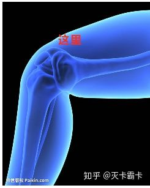
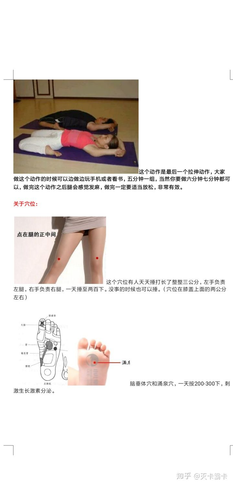
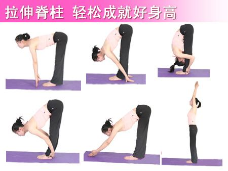

# 增高
1. 晚上捶腿半个小时以上，地方为膝盖与大腿连接处。坐着屈腿敲。不用锤的太重，微有酸麻感即可。
2. 踢腿，最好捶腿前后踢腿十几二十下，活动关节，向后尽力拉长腿骨。踢腿还可以有效的帮助拉伸韧带，变成大长腿！
3. 常按摩脚底脑垂体部位可以刺激脑垂体分泌生长激素,可以增高。 这个穴位在脚趾指腹,两只脚各一个,两个都按,100下,或者3-5分钟。
4. 早睡，最好十点前睡觉，因为生长激素在10点到凌晨3点分泌最多。
5. 摸高，就是跳起来拔树叶之类的，或者自己摸宿舍门上。我记得有传言乔帮主每天吊在门框上后来长到了一米九，顺便锻炼臂力。
6. 捶腿时候每捶一下心里默默念长高长高长高长高长高，相由心生。
7. 靠墙站，每天半小时，改善脊椎，矫正驼背，不仅能长个，同时也能提高人的气质，毕竟抬头挺胸的人看起来要高啊。
8. 拉伸，最省事的环节。

## 饮食
1. 该吃得吃，别挑食，哪怕减肥也别靠节食。
2. 饮食得均衡，蔬菜肉类都得吃。
3. 早中晚一顿别少，尤其是早餐。
4. 牛奶可以经常喝，豆浆可以偶尔喝，鸡蛋也是。
5. 添加剂很多的垃圾食品，有多远扔多远。
6. 盐糖少吃，碳酸饮料禁碰。

## 图片

## 参考资料
[高中生身高太矮，喝牛奶好还是吃钙片好？ - 灭卡霸卡的回答 - 知乎](https://www.zhihu.com/question/67272703/answer/1140395150)

[成年了还能长高吗，该如何长高？ - 曙光的回答 - 知乎](https://www.zhihu.com/question/41051970/answer/89470352)
