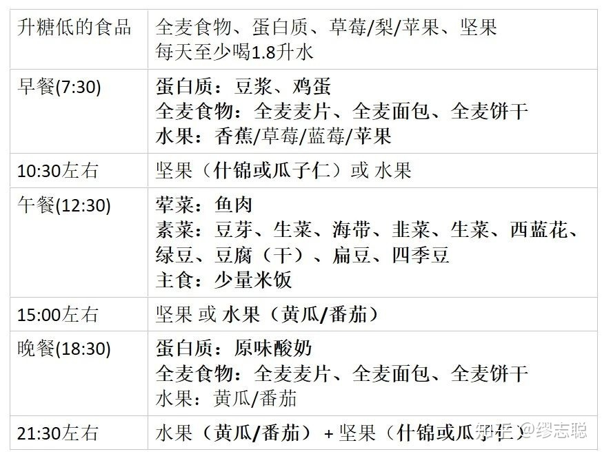

# 工作
## 优秀的工作特征
1. 做事闭环，给人的印象十分靠谱：① 沟通闭环：主动反馈过程，积极反馈结果。② 能力闭环：能力与承诺匹配，既不盲目承诺，也不碰到挑战就躲。③ 结果闭环：抱着对结果负责的态度，做到自己的最大极限。
2. 以终为始：做出了什么成果，以及为了成果付出了哪些努力。
3. 善用迭代：价值一：降低难度；价值二：减小风险；价值三：确保质量。
4. 学以致用：一需：按需学习；二信：先信后疑；三解：分解学习；四用：及时应用。
5. 从人的维度提高时间管理效率：1. 找到自己做事的驱动力；2. 用好自己的生物钟；3. 保证基本的身体锻炼；4. 适当调整饮食习惯（多吃升糖指数低的食物，少吃升糖指数高的食物）
6. 效率高，主动找活干。
7. 对工作成果精益求精。
8. 能做好自己个人形象管理。
9. 能够解决问题。
### 工作效率高
1. 提高决策的正确率。  
   1.1 学会识别周围同事或团队成员无意识发出的一些信号，比如"我上次说过了""这肯定没问题""上次我们应该沟通过这个事情""大家不是都同意的嘛"这样的语句，因为在这个过程当中，很有可能有人会给你挖坑，影响你的决策。  
   1.2 永远找一个反对者，这个反对者在你做出一个方案和决策的时候，他也许也站在你这边，但是一定要找出至少1个反对的理由，然后你把这些反对的理由反复思量，最终再做出决策。  
   1.3 要在休息好的时候做决策，不是非常疲劳的时候做决策，这点非常重要。
2. 合理分配任务和时间。  
   2.1 先将工作分类，然后给予这些分类大块的时间。  
   2.2 为每一类工作安排合理的时间。比如提前几分钟结束上一个会议，稍微休息一下，或者做一个冥想，为下一项工作预留出休息时间。
3. 拒绝干扰。  
   3.1 集中回复，关掉通讯。不要觉得无时不刻都要秒回邮件，1个小时不回，天塌不下来的。专门找一个时间，统一集中回复，会更有效率。拒绝手机，邮件的打扰，专心在一件事情上。  
   3.2 杂事琐事自动化，外包化。将不那么有价值和自己不是很擅长的事情，外包给别人做，或者建立SOP，制作自动化的工具，让别人或者机器来为我们提高效率。
4. 番茄工作法
### 能够解决问题
1. 准确发现定义问题  
   1.1 发现问题的本质，做很多层的逻辑推导，然后找到发生问题的逻辑关系，一直往下找，直到你发现有一个抓手，你解决了这个抓手的问题，其他的一串问题如同多米诺一样，一同被解决了，这个抓手问题就是你要去解决的问题  
   1.2 问有效的问题，不要总是问一般疑问句，比如问行不行，好不好，对不对？要多问开放性问题，要多问 who，when，why，what，how，从各个维度来问，直到获得足够的信息  
   1.3 多找几个有同样问题的人，多找几个人，看看问题是不是都一样，结合不同的角度和说法，看到问题的本质。
2. 找出最好的方案  
   1.1 列出多个方案，权衡利弊，记住，在成年人的世界里，没有对错，更多的是权衡，是选择。但是在选择方案之前，必须清楚选择之后80%可能发生的结果。在期间要照顾利益相关者的利益和感受，一个好的方案，不求所有人全票支持，但必须是不会过分动到其他人的蛋糕，使得其他利益相关者不会故意在里面使坏阻挠的方案。  
   1.2 多和问题所有者沟通，不要以自己的价值观来权衡，因为一旦从对错问题变成了权衡问题，那什么东西更有价值，更重要，就是问题者本身的决定，而不是自己的决定。  
   1.3 敢于帮提问者做引导，虽然问题不是你的，但是在信息和知识不对称的情况下，要敢于引导问题者向利益最大化可能的方向去走。
### 开心和钱都不是最重要的东西
第一是工作不要用绝对的钱来衡量，因为货币是在不断贬值的。你要用自己工作的不可替代性衡量，这样无论货币怎么贬值，你做的事情只有你能做，那么你的收入就能随着通胀水涨船高。

第二是不要给工作寄予开心这个奢望，工作是不可能开心的。哪怕你的工作是你的兴趣点，但是一旦兴趣被赋予赚钱这个属性，就开心不起来了。工作的终极目标不是开心，而是安心。是无论任何状态下，你的老板不能缺少你，你能用自己的本事养家糊口的安心。“

在工作中，用5到10年磨练出自己的不可替代属性，那么长期看来，必然会有更多的钱来找你。

在工作中，营造合适的人际距离和亲密度，让环境给你安心。而开心不要在职场寻找，要从家庭和朋友圈子里寻找。

## 参考

