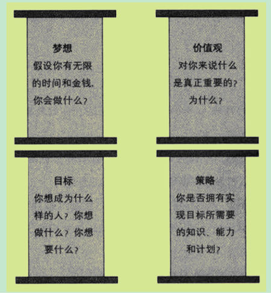

**5个领域：健康、财务、关系、情感和人生意义。**

没有健康的身体，一切都无从谈起。不能控制情感的人无法激励自己去完成既定的目标。良好的关系是基础。人生意义指的是从事你真正喜欢的、适合你的并有益于他人的工作。我们的财务状况也属于这个范畴。
当我问他一个人应该思考什么问题时，他回答：“认识自我，找到自己的所爱。然后思考如何以此来赚钱。最好每天问自己这个问题，并不断去寻找更好的答案。”



如果我们真的希望改善自己的处境，那我们可以马上开始。解决方案当然不会从天而降，靠天靠地不如靠自己。我们可以马上对自己私人领域内发生的一切承担起责任并同时扩大可控范围。过去我们已经成功地这样做了，将来我们仍然能够做到。

1. **离开舒适区**  
   当我们敢于尝试新事物、迎接新挑战时，我们就会获得成长。那些拥有最大控制范围的人，几乎总是处在他们的舒适区之外。对他们而言，如果没有一个危机接着另一个危机的刺激，他们就会感到索然无味。
2. **问题解决问题也是扩大我们可控范围的重要机遇。**  
   问题之所以成为问题，是因为它处于我们的私人领域之内，却在我们的可控范围之外。每一个问题都可能掩盖我们进步的机会。如果我们仅仅是问自己：“怎样才能解决这个问题？”那我们就不会有很大作为。但是，我们也可以换一个角度问自己：“我怎样才能创造一种环境，以防止这样的问题再次出现？”这样的新局面总是意味着我们可控范围的扩大。
3. **正确的问题我们已经讨论过，问题的质量决定生活的质量。**  
   为什么？因为我们在与自己持续地对话。我们的大脑不断地提出问题，然后由我们自己来回答。当我们问自己“我能行吗”的时候，我们并未排除失败的可能。这个问题增加了一种怀疑因素。一个更好的问题应该是：“我如何才能办成这件事？”这个问题排除了可能会失败的怀疑。问你自己怎样取得成功，你才能成功。这促使你去寻找在你可控范围之外的机会。  
   **我们首先不应当问“为什么”，而应当问“怎么做”。**“怎么做”让你寻找答案，而“为什么”则让你寻求托词。我们总会找到我们要寻找的目标。寻找托词并能如愿以偿的人不需要去扩大他的可控范围，因为他不必负责。这样，他就变成了一个弱者。而敢于问“怎么做”的人也会很快找到答案，答案会将他引出控制范围，因为他的问题包含了“为什么”。而另一方面，“为什么”并不包含“怎么做”，它不能促使我们去寻找解决方案。“我能做什么”这一问题同样重要。想象一下如果我在加利福尼亚一门心思都是想我做不到和不知道的事，会发生什么？我肯定可以找到许多马上回家的理由。  
   因此正确的问题应该是：“我能做什么？我知道什么？我有什么机会？”  
   如果我们问自己：“这是谁的错？”我们就会寻找借口。如果我们说“都是你的错”，那么将事情引向积极方向的机会就完全消失了。而且，追究责任只会让我们纠缠于过去，丝毫无助于我们扩大可控范围。我们需要着眼于现实，问自己现在能够采取什么措施，集中精力解决当前的问题。  
   我为什么要这样做？决定“是”还是“否”。  
   我应该怎么做？怎样解决下一个难题？牢记不能放弃的理由并矢志不移。
4. **扩大你的私人领域你的私人领域包括所有能够影响你的事物，包括对你重要的以及你感兴趣的事物。**  
   对你认为重要的事物，你希望施加影响。为了在私人领域里尽可能由你自己说了算，你自然会想要扩大你的可控范围。  
   一家公司的客户群与公司的影响范围是同步增长的。很多公司专注于它们现有的客户，希望了解这些客户购买的动机。而另外一些公司则专注于非客户，希望了解他们去别处购物的原因以及如何争夺这些潜在的客源。后一种公司的影响范围显然要大得多，从而使它的客户群也随之扩大。

我们对自己的所为负责，也要对自己的所不为负责。逃避责任的诱惑有时非常大。不用承担责任往往看起来愉快而潇洒，但这样做会让我们付出极高的代价。因为我们将逐渐沦为他人的工具，按照别人设计的方式过日子。当我们发挥出最大潜力时，能得到最大的满足感。我对成功的定义是做最好的自己。当我发挥出自己最大的能力时，我会感到最大的活力。

**只有未来才能决定我们用自己的钱去做什么。而我们用自己的钱去做什么，也会在未来显示出效果。** 我们为金钱增值采取的行动，也会对未来产生影响。我们像设计师一样勾勒着我们的未来，我们今天的设计蓝图决定着我们明天的生活方式。古巴比伦人早就知道了这个道理：“我们的明智之举使我们终生受益，而我们的不智之举也会贻害终生。”你将会看到，金钱比大多数人想象的要美妙得多。积累财富也比你想象的要简单得多。但是，你必须承担起责任并重视金钱。贫穷是无所作为的产物。当你拒绝承担责任的时候，贫穷就产生了。为了富有，你必须采取一些基本的步骤。这一点我们将在后面详细论述。一切都起源于你的头脑中。你——也只有你——才对你在 7年之内挣多少钱负有责任。要诀为你的人生和财务状况承担起全部责任。脱离舒适区。把问题当做成长的机会。提出正确的问题。扩大你的私人领域。我们对一些事件无能为力。但是，你可以决定如何判断以及如何作出反应。如果你这样做，你就总能够把握自己的命运。责任意味着：没有任何东西能改变你的态度或品格，因为你的反应便是你本人的体现。你自己决定自己的生活方式。这种态度将使你过上幸福的生活，并使你做到最好。当你勇敢地承担起责任的时候，你就可以在 7年之内致富。

**大多数人高估他们在 1年内能做的事情，而低估他们在 10年里能做的事情。**

第一个层次：你对现状严重不满。因此，你决定采取行动。例如，你的书桌上待处理的邮件堆积如山。于是你决定处理掉它们，一直到你能重新看到书桌桌面为止。

第二个层次：期望的结果没有出现，你开始认识到一般意义的行动还不够。你必须采取更有针对性的行动，以解决问题。你问自己：“我怎样才能使结果改进？怎样才能用巧干代替苦干？”

第三个层次：技巧已经帮助你取得了一定的进步。但是，当你与其他成功人士比较时，你会发现他们取得成就好像比你更容易。他们可能有一些有影响力的朋友帮他们打开了门路。

第四个层次：多想一想你自己以及别人，重新考虑你的世界观。很多人凭直觉就把这个美好的世界想象成丛林，认为你需要通过尖利的爪牙才能生存。

第五个层次：通过改变对自身的认知，我们可以带来巨大的改变。

第一个层次：如果我们能得到援手，奇迹就会发生。第二个层次：如果你去捕鱼，可以学会捕鱼技术。第三个层次：你应当是一个别人乐于求助的人，因为你被认为足够强大并有竞争力。彼得遇到问题马上想到耶稣，因为他认为：“耶稣肯定有办法。”第四个层次：税收不是问题。政府并不是为了榨干你的血汗而存在。第五个层次：你应当做一个“没问题”的人。

**4个方面会有助于我们不断学习和成长：书籍，你的个人成功日记，讲座以及榜样。** 而不断学习和成长会促成奇迹。

日记本是空白的书，每页的文字都要由你自己写就。每个人都应该有一本自己的成功日记，将每天的成绩记录下来，写下你得到的每一句赞扬、每一次认可，无论是因为遵守纪律、完成任务，还是助人为乐。

自信不是一件偶然的事情。无论有多少自信都不嫌多。我们是止步不前还是取得进步，取决于我们是否拥有勇敢迈出下一步的自信。

缺乏自信的人为了保护自己而不敢承担风险。然而，不敢承担风险的人将永远无所作为，两手空空，一事无成。

讲座还有另外几个好处：我们可以同时听、看、感知和经历。我们的感官接受的刺激越多，学习效果就会越好。此外，在讲座上我们还可以与主讲人对话。甚至在大型讲座中，与主讲人结识，并与之建立起某种联系也是有可能的。

**自信心决定我们是否敢于冒险。** 不承担风险，就不能成长。我们的思想意识、我们接受的教育和所处的客观环境通常不利于我们培养自信心。健全的自我评估意味着自信。你的成功日记可以让你意识到自己有多么出色。记日记使你学会专注于自己的长处。一段时间以后，你就会开始发现自己的长处，并想：“噢，这件事可以写到我的成功日记里。”我们的期望决定我们最终的成就，而我们的自信又决定我们的期望。

从诞生的第一刻起，我们就通过模仿学习几乎所有的知识和技能。环境对我们的影响远远超出了我们愿意承认的程度。任何书籍或课程对我们的影响都大大弱于我们周围的人。近朱者赤，近墨者黑。但我们通常倾向于低估身边的熟人和朋友对我们的影响，因为我们喜欢把自己看做独立的人。我最近的一任导师这样表达他的看法：“入苍则苍，入黄则黄。”

**我们常常忘记，如果沿着老路走下去，同样有风险。仅仅因为很熟悉，并不意味着一定更安全。**

**要改变事物，我们必须首先改变自己。** 任何变化对我们来说都意味着风险，因为我们以某种方式脱离熟悉的环境。成长总是发生在舒适区之外。我的一位导师总是说：“离开你的舒适区！解决旧问题之后，马上用一个新的、更大的问题取而代之。”

**运气由以下几部分组成：积累资本；识别机会；当机立断，迅速行动。**

我们是否愿意为一切承担责任，包括奇迹和运气？如果愿意，你将为自己创造的奇迹感到惊奇。如果不愿意，你将只能抱怨“时运不济”（但谁能战胜命运呢）。如果你勇敢地承担责任，那么幸福就在你的计划之中。
### 建立长远目标
要长期坚持不懈，即使非常简单的事情也变得困难起来。遵守纪律和改变旧习惯不是件简单的事。

**定义财富有 3个要求：明确的数目，记录总数，并可以形象地加以想象。**

**尽可能不去改变你的长远目标很重要。目标越高，越没有必要进行经常的修改。**

大目标还有其他优越性：它提高了我们识别机会的能力。人们倾向于仅对值得付出的事物感兴趣。因此，如果我们确立的是更有意义的大目标，我们就会更有兴趣，就会发现更多的机会，结识更多的新朋友。

3个月里坚持这样练习。最后，你将发现自己的潜意识开始接受：如果不实现这些目标你就不会幸福；生活不发生变化你就会非常痛苦。你必须实现既定目标。然后你就可以在众人面前公开你的致富计划。

请写下一个大目标（房子、汽车、工作、活动、公司、合作伙伴、旅行，等等）。描述要尽可能详细，不要漏掉任何细节。现在闭上眼睛，想象当你有了预想的房子、汽车、工作和公司之后会是什么样子。想象某次典型的日程安排：你需要做什么？什么活动是必需的？有可能出现哪些困难？现在感觉怎么样？如果你能坚持练习 10分钟并且感到舒适，你就基本能确定你对预定目标感到满意。毕竟，永不放弃更有优势。

要找到借口很容易。下面就是两个最危险的借口。它们很有害，因为它们往往被当成一种人生态度。但实际上，它们是谎言和借口。将来我也会为现在所拥有的感到满足。假如我竭尽全力，我也会功成名就。这两种借口的背后隐藏的常常是自欺欺人、怯懦和缺乏自我价值追求。

**110%的努力，你才能挑起自己人生的重担。** 你不想，也不再有任何借口。你必须成功，你也将成功。付出 110%的努力预示着进步。

理财教练的身家至少应该是你的 10倍。他能够帮助你避免错误。他开启你的潜质，让你不再浪费时间。教练能够给你有效的激励，特别是当他严厉要求你、让你感受到痛苦的时候。他监督你的进步，检查你的成绩。他时常督促你迈向比你自己设定的更高的目标。

**请写下你认为自己哪些特点有助于致富，哪些特点妨碍你致富。** 你的优势和劣势是什么？记得你是从哪一列开始填的吗？任何首先关注自己劣势的人永远不会致富。这并不是说你应该忽视自己的劣势，这里涉及的只是你关注自身优势和劣势的顺序，而这一点对于能否致富至关重要。也许你曾经听说过，只有彻底扭转劣势，才能获得成功。如今这种观点已经不再适用。现在我们知道，克服劣势并不能使人致富。与劣势搏斗只会导致你消耗太多的能量，最终流于平庸。

有多少人丧失了生活的乐趣和致富的机会，就是因为他们想竭力克服自己的劣势。这常常是一场毫无希望的战斗，它使所有的乐趣丧失殆尽。你不能忽视自己的劣势，但你也不能太过重视自己的劣势，因为这不能使你致富。因此你必须针对自身弱势找到一个正确的解决方案。如果到现在你还不是一个好会计，那算账恐怕永远不会成为你的强项。所以你的出路就是接受这个现实，雇用一名会计。

**大目标比小目标更有可行性，因为问题不会完全挡住通向大目标的视线。** 成功人士深谙置之死地而后生的道理，不达目的，绝不罢休。如果人为划定极限，我们就一定会达到。不仅要为失败承担责任，也要勇于成功。如果你认为自己辉煌不再，就丧失了提升自我价值的机会。付出 110%的努力、杜绝借口的人必定会成功。你需要一位优秀的教练运用他的经验来发掘你的天赋。任何首先关注自身劣势的人都不会赢得财富。消极防守和主动进攻之间有巨大区别。许多人丧失了生活的乐趣和致富的机会，就是因为他们竭力想克服自己的劣势。你必须为富有付出的代价是时间。但这与你通过致富而赢得的时间无法相提并论。富有能够使你在内心平静和没有金钱困扰的状态下思考人生。

感觉富有，学会对金钱泰然处之。习惯有钱。在金钱问题上学会自信。消除对失窃或被劫的恐惧。为紧急情况做好准备并在遇到有价值的交易时永远有充足的现金储备。训练你的自我约束力。你的潜意识将帮助你赚钱，因为它看到金钱给你带来了快乐。

大多数建议者是在为自己的现状辩解。建议本身常常正是建议者的痛处。劝你不要冒险的人在自己的生活中也会谨小慎微，因为他们自身也不敢承担必要的风险。所以，建议常常是建议者对个人状况的迂回式的辩解。此外，建议者当然不会忘记自己的利益。希望孩子留在身边的父母几乎不可能建议孩子接受国外的聘任。

为实现财务目标而改变你的信仰。记住，你的生活真实地映射出你的信仰。找出你的哪些信仰是“负责任的”。将证据与观念分离，用更有助于你实现目标的新观念取代旧观念。找出支持新观念的证据，将观念转变为信仰。改变信仰之后，你会从事新的活动、养成新习惯，最终改变你的生活。千里之行，始于足下，现在就迈出第一步。现在，你已经为财务成功奠定了基础。为了实现你的财务目标，你需要 3种信仰：一些事必须改变。我必须改变这些事。我能改变这些事。

个人的现状是其信仰的真实反映。基本上，你今天所拥有的，正是你认为对自己合理、有益的。大多数人对富足的消极看法，超过了对财务自由的积极看法。财务状况和对理财的所见所闻对你有相同的影响。摒弃有害观点是有效改善财务状况的前提。不了解或不改变自己的信仰而指望发财致富只会适得其反。建议虽然给你指明了方向，但也为你划定了界限。建议通常是建议者掩饰自身糟糕状况的理由。从最好的地方——而不是身边——寻求建议。发展有助于你实现内心真实渴望的信仰十分重要。你可以在 30分钟内改变任何一种信仰。我们每个人过去都曾经改变过态度或观念。当时无意识或偶然的成功，现在可以有意识地做到。决定信仰的标准必须是：这种观念能否帮助我实现目标？无论何时，只要生活与想象出现矛盾，你就应当找出导致这种状况的信仰。为了实现你的财务目标，你需要 3种信仰：一些事必须改变。我必须改变这些事。我能改变这些事。为了变愿望为决心，我们需要使用杠杆。这种杠杆由避免痛苦和体验快乐构成。你可以自己制造杠杆。失败时感受痛苦，成功时享受快乐。每个实现了大目标的人，在开始时都会用 90%的精力解决“为什么”，而只用 10%的精力解决“怎么做”的问题。

**我强烈建议你限制任何形式的消费借贷。** 记住：我们想要的并不一定是我们需要的。公司建设则完全是另外一回事。在当今时代，没有其他人（ Other People ，缩写为 OP ）和其他人的钱（ Other People's Money ，缩写为 OPM ），公司的快速发展几乎是不可能的。

消费借贷没有任何优点。说得更清楚一些：消费借贷没有意义、没有建设性、打击士气、耗费精力，通常使你陷入恶性循环。

当我们花掉自己计划挣的钱时，就会失去挣钱的动力。而且，我们知道或起码能感觉到消费借贷没有好处。但我们的行为与我们的意识产生了背离，这样，我们就失去了自信。自信心不足也会导致动力不足。

我们的强大动力来源于对美好前景的憧憬。当我们致力于长期战略的实现时，自己才会成为专家，美好前景才能实现。如果个人债务对你形成强大的压力，你就没有时间和动力运用长期战略并实现最终目标。当一些细枝末节的事务突然变成要紧的问题时，你将被迫使出全副精力去应付它们。

**寻求长期解决方案或者寻求短期解决方案。** 寻求短期解决方案只会使我们离长远目标更加遥远。请记住，我们的目标是走向富有。借贷可以使我们提前享受还未挣得的财富，但这会大大降低我们获取财富的动力。没有动力，我们就不会取得进步。金钱只能被使用一次，如果今天我们算算自己的收入，会发现它完全没有增加。这时我们就要问问自己：“我工作是为了什么？”当我们花掉自己计划挣的钱时，就会失去挣钱的动力。

**减债 13招认准你的长期目标。** 确认你的思想、言行是否有助于实现目标。改变你的信仰。既想应用我建议你的方法却又不改变你的信仰只会事与愿违。永远不要说：“这点钱没用。”现在，每一分钱都是重要的。将你的开支列一张清单。虽然很无聊，但我向你保证，这绝对值得。一定要严格按照预算行事。马上毁掉你的信用卡。当你拥有 10万马克时再申请一张新的。将透支额转为普通贷款。后者利息较低。你可以马上开始还款。将别人的欠款罗列出来，亲自到债务人那里收款。可向他们提供分期偿还的机会。对收到的每笔还款一定要千恩万谢。同你的债权人坦诚相见，逃避只会带来误解和不快。如果你能开诚布公，大多数债权人会同意你提出的还款计划。每月还款数额最多不超过扣除所有支出后剩余钱数的一半。这有以下两个原因：第一，你要马上开始存钱；第二，你需要偿还一定数额以使债权人不致失望。对每一项支出，都要问自己：“这是必要的吗？我一定要花这个钱吗？”寻找新的收入来源。确定每月支出的最高限额和收入的最低限额。培养危机意识，模拟极端严重情况并迅速应对。毕竟，你不是已经改变了信仰并毁掉了信用卡吗？

自我认识
成功日记
个人优点

不要怨天尤人
不要害怕
不要被别人左右
不接受怜悯

我们需要树立一个赢家形象。机会青睐赢家。赢家从不怀疑自己。
永远留有一定现金，即使你已一无所有。

在保险柜里存放至少 5万马克现金。这样，超过 80%的严重问题将得到解决。困扰你的将不再是大笔的债务，而是分散的小问题。这笔钱是应急储备，只能在破产或签署还款宣誓书后才能动用。在此之前你应该拼尽全力去解决问题，只当这笔钱根本不存在。这笔现金能为你提供重新开始的机会。这 5万马克对你的自信心和安全需要都有好处。为自己、为你的健康以及你的家庭，你都需要采取这种策略。

月末，将余钱的 50%用于还债，将另外的 50%存起来。用这种方式，你可以立即开始建立自己的财富。你在向令你鼓舞的目标努力奋斗，建设富有的生活，同时减少债务。建立现金储备，开发自己的财富意识。永远保证在紧急情况下手里有钱可用。在负债情况下筹集贷款非常困难。

学会自律

过去，我认为自由就是做有能力做的事，而不是做任何想做的事。今天，我给自由的定义是：有完成特定目标的自我约束力。
自律是力量，决定着我们潜力的发挥程度。没有自律，天赋只会白白浪费。

所谓知足者常乐，实际上是自暴自弃。他们满足于最低的生存条件，默默无闻地躲在生活的暗处。但不要忘记，负债并非因为无能，而是因为怀有有害的信念。很多人在负债后降低目标的唯一原因就是缺乏自信。一个债台高筑却依然充满自信的人会认识到，除了全力以赴他别无选择。他知道，死抱着过去的期望将一事无成。期望决定我们的收获。期望生活给予丰厚回报的人，生活也能给予更多的回报。江奈生·斯威夫特曾不无讽刺地说：“无所期待的人是幸福的，因为他们不会有失望。”

困难总是存在的。如果没有问题或者暂时忘掉烦恼才露出笑容，我们就永远无法享受解决问题的乐趣。想一想，当你为某种特别的成就感到自豪时，实际上是因为你驾驭了某种困难的处境。问题也是一种礼物。我们渴望得到礼物，所以我们才去寻求。每一项困难里面也隐藏着一个机遇。我们需要挖掘问题里面的机遇。这样我们才会感受到幸福。至少，面对问题我们不能垂头丧气。

与恐惧搏斗的效果同样不佳。对付恐惧的一个有效方法是感恩。当你对未来感到恐惧、对目标感到怀疑以及对前途失去信心时，可以停下来做下面这个练习：写下让你感激的 5件事。恐惧就像黑暗，既不能拔掉，也不能铲除。但你能用感恩“照亮”它，就像用光照亮黑暗一样。不花钱和存钱是两码事。这个道理同样适用于债务。与债务斗争就跟与黑暗斗争一样。这就是五五法则十分重要的原因。战胜债务的最好方式是建立财富。

将你的“有毒”处境变做“药物”。用你的处境激励自己。不要指望轻松舒适的处境，要希望获得更多的能力。不要指望问题化为乌有，而要希望获得解决问题的能力。压力有时是件好事。它能防止你浪费自己的潜力。现在，你必须积极、主动并有创造力。既能是毒药，也能是良药。这完全取决于你。你如何看待自己？你是专家吗？专家是在没有压力的情况下也能做到最好的人。说得更清楚一点：每个人都能够面对成功，但能否把握失败才是问题的关键。负债不要紧，要紧的是我们处理债务的方式。

绝不用短期方案解决长期问题。消费债务会摧毁你的动力和信心。信仰决定我们是否负债，而信仰随时可以改变。集中精力处理债务，不要抱怨，不要指责任何人，包括你自己。用债务学习自律。当改变信仰时，你将轻松学会自律。把目标定得再高一点，因为期望决定你的收获。每一个问题也是送上门来的一份礼物。问题中也有乐趣。财务压力既能是“毒药”，也能是“良药”，决定权在你手中。任何人都能面对成功，但应对失败却是一门真正的艺术。负债不要紧，要紧的是我们处理债务的方式。

如果你能“挣”更多，你才能得到更多。总体来看，你的收入准确地体现了你的市场价值。市场对你毫无偏见，总是按照你的价值支付给你报酬。提醒一下，我们这里讨论的不是你作为一个伴侣、朋友或父母的价值。

展现你的优势金钱和机会不会服从于你的需求，只会服从于你的能力。你的收入增长，并不是因为你需要更多的金钱，而是因为你通过自己的能力挣得。

关心你的义务，而不是权利如果太关注个人的权利，你就会寸步难行。问一下你能为公司做什么，而不是专注于公司能为你做什么。一个首先关注权利的社会注定会失败，一段各方只关注自身利益的关系也不会长久。

如果你得到 8小时的薪水，不妨工作 10小时付出应大于别人对你的期待值。让你周围的人感到惊讶，超出他们的预期。

只争朝夕如果说成功还有最后一个秘诀，那就是将平凡的事务转化成紧急事务的能力。你的座右铭应该是：“只争朝夕。”要把工作当成一场竞赛，要用速度让别人感到吃惊。保证你的时间比别人都快。你也许会说：“如果疲于奔命，我会忙中出错。”这是可能的，要在极短的时间内完成大量的事，任何人都难免出错。但是，首先成绩总是第一位的，它超过了错误。其次，错误未必是坏事。如果你害怕犯错，就难成大事。现在没人追求完美。追求完美使人谨小慎微。追求卓越才应该是你的选择。害怕犯错的人想做到十全十美。不怕犯错的人追求卓越。因此，请问你自己：“我怎样才能有卓越的表现？”请集中注意力，尽快回答上述问题。不要迟疑。

尽快完成每一件事。不要怕失败。 IBM的托马斯·J·沃森说过：“想在我的公司获得升迁，你必须把自己的错误翻一番。”错误意味着经验，经验帮助你快速作出正确决策。学会相信直觉，迅速作出决策。凭直觉行动，你会犯错误，但你会做更多正确的事。如果你的快速决策有 51%是正确的，你将变得富有。

勿以事小而不为该做的事一定要做好。不论是写信、打电话，还是搬椅子布置会议室，任何事情都有它的意义。做任何事都要全力以赴。想象一个亿万富翁正在盯着你做的每一件事，然后根据你的表现决定是否选你做他的合作伙伴。记住，我无意暗示你将每一件事做得完美。完美意味着不出差错，害怕出错将导致停顿。如果有谁介绍一家追求完美的公司，我一定可以向你指出这是一家停滞不前的公司。

使自己不可替代承担工作范围之外的责任，让自己受人瞩目。每家公司都有一两个不可替代的人，请成为这样的人。这并不是说你要大包大揽，而是说要多承担责任，以扩大你的影响力。应该主动请缨，承担起项目的管理责任，树立“我就是公司”的观念。

学海无涯在进化之初，人类是依靠本能反应来行动的。当看到猎物时，就迅速发起攻击；当出现危险时，立刻爬到树上。由于我们开始认识环境并制订计划，人类从不断迁徙走向定居。为了几个月后的收获现在就开始播种，是一种重要的意识转变。为了以后获得更高的收入接受

10年不看电视，每天花 2小时阅读专业书籍，你也许不了解德国足球甲级联赛的战况，但你的平均收入肯定是那些每天看两三个小时的电视的人的 2 ~ 3倍。

越是困难越向前想多挣钱，就不能回避问题。战胜问题才是好主意。分配的任务越困难，就越要主动向前。

让自己成为专家如果做别人都在做的事，你的价值就像沧海一粟。如果你在北海的钻井平台失火你找谁？当然是瑞德·阿代尔

不变则不通如果你渴望环境改变，必须首先改变自己。如果想在 3年、5年或 7年之内有所创新，你必须做好准备并尽力促成有利的局面。7年后是否一切依旧？生活是否一如既往，结果是否毫无改变？你是否为别人刮目相看？

让我告诉你一个我知道的快速成为专家的最佳方法。今天你就写一页整版广告。在这页广告中，描述你的特长和你能提供的服务。这样做有很多好处：

个体老板和雇员一样挣工资作为个体经营者，成功与否很大程度上取决于是否做好同时扮演职员和老板双重角色的准备。这意味着，即使你是一个自由职业者，也必须为自己支付工资，将工资从公司账户划到个人账户。这同时也意味着，你必须公私分明，每月给自己划拨相同的工资。如果你不这样做，很可能会出现下面的问题：

如果你是个体经营者，给自己发一份固定工资。使每月只花固定数额的钱成为习惯。公私分明。存钱。这可以使你目标明确，动力十足。最终，你的收入将提高。两年内你就可以为自己赢得 12个月的财务保障。只要愿意，你可以一年时间什么也不做，完全靠积蓄生活。你自由了。只用 7 ~ 10年你就可以实现财务安全。你的“鹅”长大了，每月给你带来将近 1万马克的利息收入。你不用再为谋生而工作，而是为了享受人生。

如何分析你的收入
能力
精力
影响力

自我评价你是否知道感知即现实？你自我推销的技巧如何？你是否看起来信心十足？你的自信有多强？你是否自我感觉出类拔萃、极具竞争力？你是否善于表现自己？其他人是否将你当做专家？是否有人仅仅因为你的出色而愿意免费为你服务？别人是否觉得能结识你是三生有幸？你能不能给自己准确定位？

创意你有创造力吗？你是否愿意接受新事物？你是否在坚守目标的同时，乐于尝试各种实现目标的新方法？你是否头脑灵活？是否随时记下突发的灵感？你是否相信灵感并乐于付诸实施？你个人的“创意工厂”发展到了什么程度？你是否总是问自己：“那对我适用吗？”“我如何马上应对？”你是否理解世界上有你所需要的任何信息和解决方案？你是否认识到为了获取这些信息，你必须不断发展你的创意？

要计算出总分，你只须将得出的单个分数相乘。最高得分是 100万（10×10×100×10×10）。这里有一个例子：你的能力得分是 5分，精力得分 10分，影响力 3分，自我评价 6分，创意 6分，把这些相乘得到你的总分 5400分。如果你的影响力得分提高到 30分，总分将达到 5.4万分（月收入）。

如何改善收入的构成要素能力从上述问题中你可能已经得到了一些启示。要阅读商业书籍和其他出版物，有机会多了解别的国家。如果你不懂外语，那么就从现在开始学习。我们这里谈论的学习远远超出了你的专业领域。这种持续的学习将使你成为一个更有竞争力、更容易获得成功的人。

精力由于愚蠢的、错误的生活方式，我们常常自己破坏自己的精力。大多数人通常低估了这方面的危害。如果疾病缠身、卧床不起，你如何能够一觉醒来便去征服世界？但如果你有一种健康的生活方式，就会有这种结果：耗费的精力得到源源不断的补充。能量即生命，它不是凭空产生的。我无意写一本关于健康的专著，但是，如果你想增加自己的收入，那就考虑一下如何使自己精力充沛。

影响力你必须全力以赴，使人们熟悉你的产品或名字。给杂志写文章，参加脱口秀节目，找一个优秀的公关代理，发直邮广告。

自我评价一般情况下，人们最多只能想象收入增加100%。也就是说，达到你现在收入的两倍。

创意最好的创意往往产生于你开车、散步、体育锻炼时或半睡半醒之间。我们需要随身携带一个笔记本或一台录音机，以随时记录转瞬即逝、而且往往永不再来的创意。

四大收入来源原则上，我们的收入与我们提供给市场的价值等同。而价值有 4种：产品知识服务创意你通过哪种价值来挣钱？你怎样营销你的知识？如何将你的创意变成金钱？你能提供哪些产品？记住，收入是揣到你口袋里的钱。谁欠你的钱？你能出售哪些财产？仔细想一想！

要求回报你是否只求付出，不求回报？请把要求回报看做一个自我评价的问题。你创造价值就完全有权利得到金钱回报，这是天经地义的事。你是否认为自己的服务很有价值，取决于你是否认为自己很有价值。同一种有价值的服务，专家收费很高，而你无偿提供，那么这只能说明你缺乏自信。专家清楚自身价值所在，而你不是。

从事能创造收入的活动很简单，将你的时间集中用于能创造收入的活动。明确你在哪些领域能够创收。很多人或许都能胜任相同的工作，但只有极少数人能约束自己，（几乎）只从事创收活动。你会发现，从事创收活动能让你更有满足感。当然，做其他工作可能更容易。但不要忘记，收入水平在很大程度上取决于你能够为他人所不能。

收入并不代表财富许多人并不理解财富。挣大钱并不意味着富有。通常，我们的生活水平随着收入的增长而提高。我们的“需求”不断增长，而需求增长总是和收入增长保持同步。

永不停步在积累到足够的资本、可以靠利息生活之前不要停止增加收入。当然，我们可以并且应当适当休息。我有一个习惯，每实现一个中期目标后就奖励自己。我每周工作

因为尽管收入提高了，但有两个因素却始终未变：净收入的储蓄比例和你自己。

或许你应该从另一个角度看待这种现象。事实上你付钱给每一个人，却没有付钱给自己。买面包时付钱给面包师，偿还利息时付钱给银行，买肉时付钱给售货员，理发时付钱给理发师。然而，你什么时候才能付钱给自己？

10%划到一个独立的账户上去。靠这 10%你就会富裕起来。用另外的 90%付钱给其他人。你会惊讶地发现，靠 90%的钱和 100%的钱过日子其实没有什么区别。你甚至根本不会惦记那 10%。

首先付钱给自己。在月初把收入的 10%划到一个独立的账户上去。

永远不要动用“鹅账户”里的钱。按照从本书学到的基本原则安排“鹅账户”资金的投向。随着“鹅账户”里资金的增加，你的生活会更有趣、更安全。“鹅账户”是锻炼自我约束力的简便实用的方法。

一般来说，随着事业的发展，我们的收入会越来越高，但我们还是花光了所有的钱。我们的生活水平总是与收入同步发展。这里有一个诀窍，告诉你如何避免发生类似情况。拿出加薪部分的 50%养你的鹅。由于你已习惯于靠加薪前的收入生活，所以拿出增加部分的 50%对你来说并不困难。这样，你将慢慢习惯只有 50%的加薪，而另外 50%会被存进你的“鹅账户”。

花销太多。所以你应该只把工资的 10%存起来，这 10%你根本注意不到。而 15%或 20%对你可能就太难了。

把加薪部分的 50%划到“鹅账户”上去。这样你的生活标准才不致上涨太快。这 50%不会使你痛苦，因为你尚未习惯更高的收入。每次加薪都会给你的“鹅账户”带来更快的成长。你清楚为什么工作。你向自己的潜意识展示了你有良好的理财能力。每次加薪都会使你离长远目标更近一步。作为个体经营者，你既是老板又是雇员，要定期给自己加薪。

只有当你有足够的钱可以靠利息生活时，你才算富有并获得了财务自由。只要你还没有赚钱机器，你就是赚钱机器，不管挣多少都一样。是储蓄而不是收入使你富有。只有当你能守住钱时，财富才会产生。需求总是随着收入水平的提高而水涨船高。如果你今天不能管理好你的钱，那么挣钱多了时就更不能管理好你的钱。低收入时存钱更容易，因为收入越高，相同比例的绝对数额就越大。我们真正需要的东西极少。“需要”大多是我们为奢侈提出的借口。你找不到一个奢侈的成功创业者。不要只看到金钱今天的价值，要看到它在 10年、15年或者 20年后的价值。成功人士做好了准备，去做大多数失败者拒绝做的事。靠 90%的钱和 100%的钱过日子其实没有什么区别。我们的生活水平总是和可支配收入同步提高。你可以随时改变对储蓄的观念和态度。不论存钱显得多么困难，不存钱带来的难题总比存钱多。如果你做和别人一样的事，那你也只能得到和别人一样的回报。只有当人们一无所有的时候，金钱才会变成生活中最重要的事。教你的孩子存钱。

你有足够的时间开辟新财源。锻炼你的“挣钱肌肉”。你的自信心在增强。不久之后就可以迎接新的挑战。逐步摆脱对现有收入的依赖。如果将这笔钱用于投资，你就会为将来可观的财富奠定基础。

于复利，有三大影响因素：时间、利率和投入。
越早开始，事情越简单。

利率与时间同等重要。俗话说时间就是金钱，我们也可以说：“时间给你带来金钱。”尽管很多人对此不以为然，我还是希望给你介绍一下高利率

重视金钱，尽责是挣钱的前提。谁能使资本增值，谁就能致富。谁忽视金钱增值法则，谁就会失去他的金钱。了解复利的力量而不去有效利用以实现财务自由，是不负责任的忽视。复利只有 3个重要因素：时间、利率和投入。事不宜迟。越早开始越容易。利率提高 3倍，收益将提高近 30倍。如果你不用资本和投资为你效力，整个资本主义将会与你擦肩而过。谁了解并遵守金钱法则，谁就可以获得金钱。现在该是把“少数人的资本主义”还给大众的时候了。你可以通过创造个人财富、为大家树立良好典范为此作出贡献。

：股市涨跌交替转换
法则二：放长线，钓大鱼因此，永远不要将短期内可能需要的资金投入股市。如果股市低迷而你又急需用钱，从而不得不卖掉手中的股票，你就只能遭受损失。投资时必须保证有
法则三：至少买 5只不同的股票，但不要超过 10只你应当至少投资 5只不同的股票以便分散风险，每种股票都来自不同的行业和国家。
法则四：卖掉股票之前，盈亏没有定论。股价上涨时卖掉股票就可以获得利润。即使继续持有，如果公司派发红利，也能够获得利润。
则五：利润来自股价上涨和红利
法则六：崩盘给你低价吃进的机会在股市危机中敢于大胆吃进需要坚强的意志，但回报也非常丰厚。请立即建仓，因为股价常常在下跌之后迅速回升。
法则七：不要从众 90%的股市投机者之所以赔钱，就是因为他们不遵守这些黄金法则。大多数股民只是在为少数人的利润作贡献。
法则八：抓住时机、理性决策，避免感情用事不要依赖直觉或感觉，要理性评估。如果想购买一家公司的股票，就要找到你能找到的所有关于这家公司的信息。
法则九：以自有资本投资，绝不可借贷入市只有在可能的损失不至影响到生活时，才可以投资股票。我见到过违反这一法则的人给自己带来的许多麻烦。他们都是借钱到股市投机。真是疯狂！法则十：股票总是胜过货币，将来依然如此原因之一是通货膨胀。如果投资以现金计的某项资本，资本的货币价值会因通货膨胀而减少。因为物价上涨，10

有一种经几十年实践验证的股市投资策略特别适合于保守型投资者。如果谁能约束自己遵守这些规则，就能做到每种股票都赚钱。这种策略被称为“王者之路”。
“王者之路”策略只考虑蓝筹股公司。每个行业只瞄准行业龙头。
2. 注重组合按照“王者之路”策略，股票投资组合应至少包括 5只股票，但最多不能超过 10只。这种组合中的公司，既要考虑来自不同的国家，又要考虑来自不同的行业。如果选择了日本的一家电子公司股，在德国就应当选择另外一个行业，如消费商品行业的拜尔斯道夫公司（Beiersdorf，旗下拥有妮维雅等品牌），在美国选择“软饮巨人”可口可乐，在荷兰选择荷兰皇家石油公司，等等。
3. 留有余地按照“王者之路”策略，一个保守型投资者首先等待熊市（即股市低迷时期），也就是股价指数比顶峰时下跌 10% ~ 30%的时候。即使此时，保守型投资者首次买入时最多也只会投入可用资本的 50%。
4. 坚守、补仓、赢利如果首次买入后股价没能如预期般上涨，反而下降，这时就能够看出小心选择股票是多么重要。只有对一流公司才能实施补仓策略。对二三流公司的股票进行补仓风险要大得多，因为无法保证这些公司在任何情况下都能安然渡过危机。
5. 金钱与耐心只有严格遵守法则，补仓策略才能完全奏效。只有股价比买入价下跌至少 30%才能第一次补仓。而且，从第一次购买到低价补仓应有大约 6个月的时间间隔。很可惜，许多投资者常常忽视这一法则，匆忙补仓，以致在真正的低价位时已无钱可用。
你要有足够的现金。只能将一部分现金用于股票交易，但这部分现金应足够购买至少 5只不同的股票。并至少保留 50%的可支配资金用于补仓。你需要自律。你必须保持理智。问你自己是否准备对股价进行长期关注，是否有坚强的意志，在股价暴跌时不但不平仓，甚至敢加仓。股市必须能给你带来足够的乐趣，这样你才愿意投入必要的时间。乐趣常常与好的投入产出比相关。最重要的一点是：永远不要把安身立命的老本投入股市。这条建议针对的是那些已经获得了财务安全的人士
也从另一方面证明了分散风险的重要性，你能避免全损并增加成功的机会。

不用成为股市专家，你也可以挣得 100万。股市投资者的 10条黄金法则：股市涨跌交替转换。放长线，钓大鱼。至少买 5只不同的股票，但不要超过 10只。卖掉股票之前，盈亏没有定论。利润来自股价上涨和红利。崩盘给你低价吃进的机会。不要从众。抓住时机，理性决策，避免感情用事。以自有资本投资，绝不可借贷入市。股票总是胜过货币，将来依然如此。如果选择遵守“王者之路”策略，你就可以在股市中保持全胜。投资股市的必要前提：充足的现金。自律。股市必须能给你带来足够的乐趣，这样你才愿意投入必要的时间。最重要的一点是：永远不要把安身立命的老本投入股市。投资于年轻的、发展前景良好的公司才能赚大钱。股票是我们整个经济体制的基础。没有它，我们所熟悉的经济世界将崩溃。

评估投资的质量，有以下 5个标准：安全便捷变现能力收益税收一般来说，基金大致可分为 5种：货币市场基金退休基金股票基金（即投资信托、单位信托）开放式和封闭式房地产基金混合基金在本章中，我仅探讨股票基金和混合基金，因为只有这两种类型的基金符合上面提到的 5个标准。其他类型的基金不是变现能力较差，就是收益较低。
经济增长率 × 3 ~ 5 =股价上涨幅度
不要理睬报纸的报道。标题越夸张，报纸的销售就越火。这类报道只会使你神经紧张。要独立研究形势。如果你不想拿到平均数（这个数字不会太高），就不要从众。市场总会有低谷期。在低谷期要善于利用平均成本效应。无论如何不要在低谷时抛售。因此，你不能把应急的钱用于投资基金。避免不必要的换手费用。从一只基金跳到另一只基金，就会产生这样的费用。只要尚未实现投资目标或者持有时间未超过 5年，你就应当继续持有这只基金。不要不停地算账，以确定你赚了多少或亏了多少。投资基金需要时间。通过自动驾驶仪你可以放心享受。既不要自己疑神疑鬼，也不要让别人牵着鼻子走。请记住，冬天过后有夏天，夏天过后又有冬天。因此，冬日里不要灰心，夏日里不要自负。如果有余钱，就利用冬天的机会吃进。相信基金管理公司。在市场下滑时，基金管理公司会有充足的现金储备买进相对便宜的股票。定期买入，忘掉最佳时机。没有人能永远按完美的时机行事。但是，当你准备大笔投资时，不要在市场最火暴时入市（那时价格会很高）。投资于经济高速增长的市场。你已经看到哪些市场属于这种情况。如果某个国家的经济增长速度是你所在国的 3倍，你就可以希望那里的股票会以高于本国 3 ~ 5倍的速度升值。写下你选择某些特定基金的原因。确定你的短期投资目标。只要这一目标尚未实现，你就应当持有这只基金至少 5年。实现你设定的目标时再售出。不要忘记分散风险。遵守第十二章描述的投资策略。至少持有 3 ~ 5种不同的基金。

72 ÷通货膨胀率 =金钱贬值一半所需要的年数

股票是通往财富的飞机，股票基金则是自动驾驶仪。每笔投资都应当从下面 5个方面来考察：安全便捷变现能力收益税收股票基金的波动与股市大致相同，但一般更为平缓。由于平均成本效应发挥作用，当股价处于低谷时，你可以自动买入更多股票。你的自动驾驶仪已被安装了最佳反应程序。股价波动（震荡）为你带来最高收益。投资股票基金的建议：忽视报纸的报道。下跌并不可怕——你可以通过平均成本效应利用这些下跌。避免不必要的换手费用。不要不停地算账。请记住，冬天过后夏天总会来到，反之亦然。相信基金管理公司。定期买入，忘掉最佳时机。投资于经济高速增长的市场。写下选择某一特定基金的原因。书面确定你的投资目标，达到目标就退出。不要忘记分散风险。如果想致富，必须获得高收益。持有股票基金，通货膨胀会助你一臂之力：通货膨胀使货币贬值，使实物价格相对升值。安全是最高准则。应该寻找安全的、回报率超过 12%的投资。开始时只投资于一些大型的、声誉卓著的基金管理公司。实现财务安全后再作其他考虑。

有一条简单规则：目标越小，实现越快。这与第四章的内容并不矛盾。在那里我们讨论的是长期目标。你的长期目标越高，它就越“现实”。
把财务保障的目标定小一些有 3个好处：目标越小，实现越快；花钱越少，省钱越多，实现财务保障越快；易于坚持，因为目标触手可及。

请记住这个建议：“不要成为做不重要的事的专家，或者不要让琐事影响你的主要工作。”从你的大宗预算项目上寻找解决方案，如税收、汽车、电话等。如果做预算成为你的强项，你就能创造奇迹。

建立财务保障，越快越好。为了你自己、你的健康、你的家庭和你的自信，你必须建立财务保障。人人都可以实现这个最低目标。无论发生什么，你都有财务保障。把这笔钱放到安全的地方。此外，你还为你的财富打下了坚实的基础。你终于打下了真正自由的基础。

“在你疾病缠身或者穷困潦倒时，减少欲望难，增加财富更难。

尽快建立自己的财务安全。一旦实现财务保障，马上投入所有可支配的金钱以争取财务安全。只有当你实现财务安全之后，才永远不需要动用老本。你可以去你想去的地方，做你想做的事，并且不用为付账发愁。你可以做你喜欢做的、符合你才能的事。

安全的投资包括人寿保险。但鉴于它的低回报率，你最多拿出 10% ~ 20%的钱进行这项投资。选择保险保障费用较低或没有的保单。值得推荐的还有大型的、拥有多年经验的基金。对于你的财务保障计划应当仅限于保守的股票基金或者混合基金。在实现财务保障前，要坚持把安全放在第一位。你应当接受低收益，并将一部分钱以现金形式存到银行储蓄账户。

为了实现财务安全，你需要改变一下金钱的投放比例。虽然很大一部分钱仍然为低风险投资，但是你可以将 40%的钱投资于风险适度的领域。通过长期不动用这笔钱以及平均成本效应，投资风险大大降低。余下的 20%可以用于高风险投资，例如新兴市场基金或特定国家和其他特殊基金。在这里，风险同样由于时间和平均成本效应得到降低。而在另一方面，你却获得了巨大的获利机会。切记：为了财务安全，千万不要把钱投入风险特别高的领域或进行投机。这些钱你永远不要动用。拿这些钱进行投资，保证你的财务安全永远不受威胁。

财务自由计划：50%中度风险，50%高风险

1. 目标扩展你的机会意识承诺使你用另一种眼光看待生活中的每一个人。每一种境况都对你有意义。你不断地问自己：承诺怎样帮助我实现目标？我怎样才能马上开始履行诺言？
2. 目标帮助你找到解决方案很多人浪费大量时间为自己的困难发愁。目标明确的人没有空闲在这上面浪费时间。他们只想更接近目标，因此不断寻找解决方案和途径。他们把注意力集中在目标上。一个专注于目标的人无所畏惧。3. 目标鼓舞你争取胜利避免失败与争取胜利有巨大的区别。第一次认识一个人，你就可以马上感受到他只是不想失败，还是想争取胜利。你可以通过他的目光、他的行走姿态以及他的言语判断他的精神状态。大目标不允许降低标准。你必须发挥一切潜力去争取胜利。4. 目标帮你树立高标准没有目标的人遵照这句格言生活：“一点点不足没有影响。”而对于有目标的人来说，每一件事情、每一个细节都非常重要。

近朱者赤，近墨者黑。我们通常认为自己足够坚强，可以不受周围人的影响。但是，我们从小就习惯于通过模仿进行学习，大多数时候这是一种无意识的过程。熟人和朋友对我们的影响远比想象中大得多，只是我们没有意识到这一点。

以己昏昏，不能使人昭昭。所以，不要听信平庸者的建议。与成功人士交往，自己也容易成功。为了致富，你首先必须能坦然面对财富。最容易的方法莫过于与成功者为伍。“衡量一个君主昏庸与否，只要看他周围的臣子。”（马基雅维利）尽早寻找优秀的顾问。走自己的路，让别人说去吧。向自己的榜样求教。

1. 写下需要导师的原因
2. 你能够为导师做什么
3. 你需要过硬的理由和激情
4. 坚持
5. 接受考验
6. 导师培养你解决问题的能力，而不是替你解决问题
7. 与导师保持定期联系
8. 尊重导师的时间
9. 认真考虑你的问题
10. 开放的心态
11. 赢得导师的心
12. 迅速回复导师的来信
13. 给导师反馈
14. 用成功向导师表示感谢
15. 效仿导师
16. 不要揭短
17. 饮水思源

交志同道合的朋友
在模仿别人之前，必须对模仿对象进行细致的研究和分析。你必须从多方面对榜样加以考察。如果能够进行直接观察当然不错，但这并不是必要条件。你也可以录下有关电视采访进行分析。分析的内容是他们的身体语言、讲话方式、语言模式、修辞、思维方式、感情、指导思想以及价值观等，以便决定将来是否接受他们。
成熟意味着自己控制这个过程。受谁影响、向谁学习、学习什么，完全由你自己决定。你所模仿的对象是你未来的目标。人人都在模仿，你却必须把盲目的模仿转化成有意识、有选择的行为。
至少找到一位可以效仿的榜样。尽可能多地了解他，尽可能仔细地观察他。记录你的观察结果，书面确定你的模仿策略。找出你的榜样如何处理下面 5个生活领域的问题：健康、财务、关系、情感和人生意义。模仿卓越意味着你从此自觉地把握自己的学习过程。你用这种方式成为自己未来的设计师。
有自制力的人才是真正的强者。正如孔子所言：“胜人者强，胜己者智。”
创造不成功则成仁的环境。受谁影响、向谁学习、学习什么，完全由你自己决定。只效仿比自己成功的人。与成功人士为伍，你也容易成功。为了建立专家网络，你必须考虑能为别人做什么。我们需要专家网络帮助我们做最好的自己。

按固定比例捐出收入的一部分。你将认识到金钱是个好东西并正确地使用金钱。如果你决定这样做，就用书面形式记录下你的决定和原因。制订负责任的资金使用计划。确保资金使用达到计划目标。助人为乐并持之以恒。即便实际上还没有能力承担，也要从现在开始实行这个方案。

成功意味着得到所爱，幸福意味着享受所得。富有是一笔神灵托付的财富，持有者有义务以之终生造福社会。“治愈”没有意义和无所适从两种感觉的最好的方式是关心别人。捐款证明你能够负责地、正确地处理金钱。捐款证明你的自信。捐款意味着期待更多的财富，而我们的期待决定我们的收获。爱人者人恒爱之，敬人者人恒敬之。付出使人充满生机与活力。富有而不承担责任意味着不幸。

全力致富，做一切必要的事。因为金钱能够给你带来幸福，所以它必须是你致富的目标。捐款造福他人，自己也快乐。金钱会给你带来安全感。随着金钱的增长你可以看到个人的成长。金钱使自由的生活成为可能。你可以做自己喜欢做的事，可以发挥天赋、造福他人。金钱可以更好地提高你和他人的能力。有钱才可以防止金钱对于生活过度重要。金钱是正常生活的前提。支配金钱而不是任由金钱支配。你可以集中精力做重要的事。金钱可以发挥你的优势，开拓你的思维。没有金钱，生活就会倾斜。拥有金钱，你才能从容地应对生活其他方面。金钱使生活更加丰富多彩。你可以住喜欢住的房子，交喜欢交的朋友。有了钱，你可以自由支配个人时间。你不再受生计所迫，可以充分追求个人价值。金钱意味着力量。有了钱，就有更多的机会发挥正面影响并帮助他人。金钱可以使你接触到许多永不满足、致力于发挥自身最大价值的人物。
