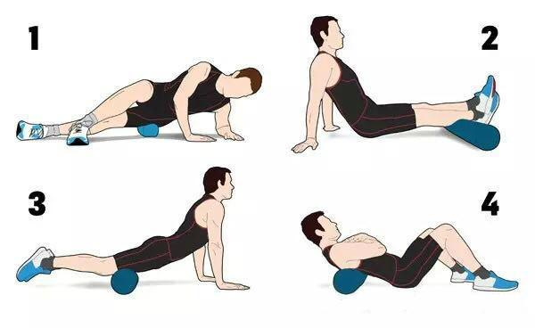

# 运动健身
## 拉伸：提升柔韧度
### 筋膜
筋膜就像我们的肌肉穿的一层衣服，衣服紧了小了，强行做动作，就会撕裂，比如穿着牛仔裤下叉，常常最后变成开裆裤，所以，预先放松筋膜，就像先把衣服改大一些，然后再去找韧带的原因，这样，牵拉的效果，事半功倍。
#### 器械
器械可以分为针对大区域的泡沫轴和小部位的按摩球（或网球等）。

**滚泡沫轴** ：将泡沫轴放到你想放松的部位后，注意，不要快速的滚来滚去，而是要慢速的去进行滚动，尽量让自己的整个肢体都被滚动到，找到压痛点以后，要停一停，保持在压痛点上30s~1min，直到压痛有减轻。

**按摩球** ：比如放松足底筋膜，我们可以踩在上面，慢速的滚动，找痛点，30s~1min一组，做3~5组即可。

牵拉具体方法：一日不练，不进则退；十日不练，前功尽废。
1. 不是越疼越好：找到自己有牵拉感的位置，然后静静的保持30秒到1分钟。
2. 基本姿态很重要：在保证完美姿态的前提下，四肢的牵拉尽量单侧单侧的做。  
   躯干部位的牵拉：注意姿态，腹部的牵拉要注意吸气展体，充分打开。  
   背部的牵拉：呼气团身，感受腹部的收紧与背部的撑开。
3. 牵拉和其他运动一样，不能一组就结束：做完一组，间歇10秒左右，继续第二组、第三组甚至更多，直到你感觉这块肌肉已经被拉开了。一般来讲2~5组都是可以的，有些比较紧张的肌肉，8组都不多。
4. 不要原地弹啊弹，弹震式的牵拉，可能起不到放松效果，也可能无法帮助你提高柔韧，甚至可能让你受伤。
5. 注意呼吸，做牵拉训练的时候，不要随意的呼吸，一般来讲，我们不需要管胸式或者腹式呼吸，我们只需要注意一点就够了，那就是，在逐步加大牵拉幅度的时候，慢慢吐气，配合动作，慢速的将气呼出。
6. 静态牵拉的时候，优雅一点，别着急忙慌的，慢慢来，越慢越好，慢慢找自己的粘滞点，然后保持。

## 参考
[如何快速拉伸开腿部后侧的韧带？ - 陈邹琦的回答 - 知乎](https://www.zhihu.com/question/35123713/answer/90944694)
