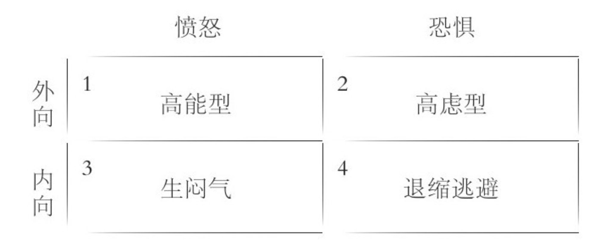

# 高难度对话
房间里有头大象：形容某些显而易见的事情正在发生，可所有人都避而不谈，而且假装什么都没发生。

## 沟通的起源
谁把我们养大，我们就跟谁学沟通！当人际关系出了问题、沟通不畅的时候，我们就会使用从养护人那里继承来的沟通方式进行沟通。我们也很少去质疑这种沟通方式的有效性。

## 人际关系的八个阶段
越是重要的关系，越是需要更多的投入。跟一个人相处越多，沟通中面临的挑战也越多，这个时候也越容易发现房间里有头大象，并且你会吃惊它是什么时候进来的。伴侣关系的发展过程：
1. 吸引
2. 靠近：通过沟通越走越近
3. 好感
4. 牵挂
5. 适应：开始彰显出独特性
6. 憧憬：开始进入婚姻生活
7. 冷淡：摩擦越来越多
8. 出路：这时，伴侣开始形成交流模式，主要分为1. 通过对话来解决矛盾 或 2. 因为感到不舒服而避免冲突

通过对话来解决矛盾需要下很多功夫，而避免冲突更容易，但长期却会损害双方的关系。

我们也许认为自己的人际关系是完美的，所以不愿意破坏美好的假象。我们绞尽脑汁装作一切都好，实际上却矛盾重重。

优质的人际关系不会平白无故的产生，只有付出努力才会有收获。
## 关系处理
有两种方法可以学习：
1. 看那些品行端正、富有爱心的人都在做什么，然后依葫芦画瓢；
2. 默默在自己的品性上狠下功夫，努力成为内外兼修的人。

人不可能一直伪装，但作之不止，乃成君子也不失为一种选择。
### 三种对话交流系统
1. 择定关系：我们选择伴侣或对象，选择朋友、组织等；
2. 偶遇关系：范围宽广，包括商场工作人员、服务员等；
3. 承继关系：我们选择了伴侣，也就选择了对方的家庭关系，我们选择了工作，也就要接纳工作中的同事。

#### 四步法
1. 划分优先次序
2. 提前准备：准备好我们的沟通交流箱，理解对方
3. 分享：倾听他人，理解他人，参与谈话而非驾驭谈话
4. 实践

### 倾听
倾听他人，理解他人，而非沉浸在自己的世界中。
### 基本需求
美国社会心理学家亚伯拉罕.马斯洛提出了他的“需求层次理论”，主张将人类需求像阶梯一样从低到高按层次分为五种，分别是：生理需求、安全需求、社交需求、尊重需求和自我实现需求。在低层次的需求尚未得到满足时，人们不会提出更高层次的需求。

智利经济学家曼弗雷德.麦克斯-尼夫将人的基本需求划分为生存、安全、感情、理解、参与、休闲、创意、人格和自由九类。

美国潜能激励大师安东尼.罗宾斯之处，每个人的选择是想让留个方面的需求得到满足：确定性/心安、不确定性/变化、重要性、连接/爱、成长和贡献，他认为人所有的异常和障碍，都来源于上述需求不能得到满足。

因此，我们的需求可以划分为如下几类：
1. 安全与保障
2. 冒险，尝试新事物
3. 成长
4. 接纳，人并不完美，我们希望有人能接纳我们的本来面目
5. 关联，分享
6. 价值感、成就感

一个人格独立的人，他的基本需求已经得到了满足，这就为健康的人际关系奠定了基础。

## 高难度对话的工具
健康的人际关系和人际交流有赖于三个要素：时间、意愿和耐心。

### 工具
1. 视角：  
   局面越僵，越需要我们转向面对面地沟通，设法弄明白对方的观点和立场。我们不能只用文本来进行对话，尤其是在对话已经变得很难的时候。
2. 信任
3. 本分
4. 情绪
5. 时间
6. 尊重

沟通的具体步骤：
* 致力于面对面沟通
* 适应不舒服
* 不要试图改变他人
* 未雨绸缪，付出时间去练习
* 寻找共同之处
* 珍惜彼此的关系，共同为之奋斗

感官的重要性：交流中最重要的感官是视觉、听觉和触觉。当我们正在跟别人艰难交涉时，我们很想知道对方所言是否属实，而某些无意间流露出的信号常常能够揭穿一个人的谎言：
* 当他们试图控制自己的反应时，姿势会比平时僵硬、不自然
* 他们时不时碰碰鼻子或摸摸喉咙
* 他们皮笑肉不笑
* 他们反应迟钝
* 他们盯着我们，眼都不眨，潜意识中在努力表现得一切正常

声音也会透露一些端倪：
* 他们重复我们的话
* 话变得复杂
* 说的很多，提供很多信息，试图显示自己很坦率
* 如果转移话题，会附和，以逃避质疑
* 语速变化
* 画蛇添足

建立信任的步骤：
* 信守承诺
* 承认错误
* 倾听
* 人前人后，始终如一
* 用心相信他人
* 反思与他人之间的关系
* 兼听则明，倾听并且重视观点，对事不对人
* 守时
* 关爱他人
* 保持一贯性
* 同舟共济

问题的关键在于，不要**因为别人的选择而让自己受到伤害** 。我们对自己负责，而不是对他人负责。假如我们把快乐和自我价值寄托在他人身上，就是把自我控制权交给了别人。自己的家自己当，不能由着别人牵着鼻子走。

使用时间的提醒：
* 建立关系，以及解决关系中必然会出现的沟通困难时，都匆忙不得。
* 人们很容易从最重要的事情中分心。
* 当谈话变得富有挑战性的时候，我们需要花更多的时间在一起，而不是狂发短信。
* 随着时间的推移，微小的情感沉淀会积累出巨大的情感储备。

#### 更换旧的沟通模式
* 将指责他人换成由我做主，我们需要为自己在一段关系或者对话中的行为承担责任。
* 把具体的期望换成一个总体的期望。当我们希望什么事情发生的时候，得到的总是失望，比如我们有时会提前自己完成了对话，琢磨自己会说什么，以及对方会怎样回复，这样的剧本很少实现，因为对方不能了解到我们的所思所想。
* 心怀期待。不论事情的结果具体如何，我们只要憧憬就好。
* 交流没有脚本，目的是建立连接，而非对换。
* 用事实取代假设，不揣测别人对我们的看法。
* 用协作来代替自私。协作是决心与同情心的结合，决心指的是我们应该正视自己的真实需求，而同情心意味着我们也要为别人争取最大利益。
* 心怀同情，让双方都感到舒适，实现互惠双赢。
* 让谦虚代替骄傲，不固执己见，保留自己观点的同时，也分析来自他人的意见。
#### 守住自己的阵地
* 当关系改变时，沟通模式也同样需要改变。
* 你不能改变别人，但可以影响他们。
* 不以他人的好恶来衡量自身的价值。
* 健康的关系需要健康的人，即拥有独立人格的人，而不是依赖性的人。
* 要下定决心：不成为别人的牺牲品。
* 我们各自对自己负责。

## 情绪
在处理重要的人际关系时，我们越是追求效率，反而越容易遭受痛苦。

当困难局面出现，人的本能往往是要么抵抗、要么逃跑。这两种反应都是人之常情，但并不可取。

解决问题的关键不是要去消除情绪或者否认情绪，而是要学习如何处理情绪。

逻辑本身不是问题，问题是讲的时机不对。只有当一个人的情绪平复下来之后，逻辑才能发挥效用。

当沟通开始变得困难的时候，彼此的情绪越来越激动，人们就觉得有了威胁。此时的反应往往分为两类：愤怒或恐惧。
* 愤怒：愤怒的人往往选择争斗，操控对话，倾向于发怒和强人所难，甚至是攻击别人。
* 恐惧：恐惧的人往往选择逃避，他们倾向于逃离冲突，因为他们害怕冲突导致的后果。
* 真正的问题是因为人们具有不同的气质，关键是两者在如何处理信息方面表现的大相径庭。

如上图，象限1的人不会羞于进行高难度的对话，而且还常常愿意推动问题解决。对内向的人而言，他们很可怕；对外向的人而言，他们则充满挑衅。我们需要认识到，他们表达出来的想法很可能是刚刚产生的，而且是一种个人情绪的表达。

象限2的人不假思索的分享想法和担忧，目光总在问题上而非寻找解决方案。我们要意识到他们的想法尚在形成，而非深思熟虑的结果。

象限3的人具有强烈的情绪，而没有成熟的意见。我们不应该急于得到他们的及时回应，欲速则不达。

象限4的人特别没劲，因为他们缺少动力，他们提不出意见，因为满脑子都是负面信息而无法思考。如果我们能帮助他们从压力中解脱出来，他们就能够燃起希望。

### 引导情绪的实际步骤
* 不忽视、不隐瞒情绪。
* 承认情绪而非逃避。
* 不带任何情绪的对话不过是闲聊。丰富的情绪是深厚的情感连接的动力和燃料。
* 向每一个人学习，研究性格和交流风格，用心打造通往他们内心的沟通途径。
* 欣赏差异，力求协同配合。

## 尊重
### 学会尊重自己
不用他人的意见来估量自己的价值。自己掌握自己生活的掌控权。为自己设立健康的界限，不再不假思索地顺从别人，要有我们自己来决定要做什么。坚持自己的信念，学会说“不”。

控制消极想法，扪心自问：它们是否准确。

### 学会尊重他人
当对话变得艰难时，不应该固执己见，捍卫自己的立场。我们要保持对对方的尊重，这样才有机会展开一场实事求是的、健康的对话。

#### 不满时表示尊重
* 力求公正、准确、不夸大、不夸张。
* 不轻视别人。
* 注意倾听。
* 避免过于绝对的表达方式，比如：“你从来都不……” “你总是……”。
* 不要攻击别人的性格。
* 说实话。
* 不打断对方。
* 努力去理解别人的观点，即使你不同意。
* 要有耐心，而不能急于求成。
* 要控制情绪，不能被情绪控制。
* 不要狡辩。

## 技能
1. 营造安全感。
2. 消除畏惧。
3. 践行倾听。
4. 坦诚反馈。
5. 从善意出发。
6. 明确自己的目标。

### 如何让他人感到安全
学着去关注他人的需求。有意识地让别人感到被珍视。做法是：
1. 把它们描述出来，倾听，描述对方的语言，关注对方的感受。
2. 控制我们的反应，问题不在于情绪，而在于如何表达。
3. 确认期望，明确要做的事情。
4. 接受他人的缺点，人无完人。
5. 在人际关系中建立界限，不越界。

当对话变得艰难，别让问题挡在两个人之间，一起努力，共同解决问题。不要指望别人去改变，要让他们接受，不论他们是否改变，我们都接受。就算不同意对方的观点，也要表示出对他人的尊重。

### 消除畏惧
把注意力从“我觉得”转移到“事实是”。

当我们直视他人的眼睛时，我们就跟他们联系上了，他们就变成一个个真实的人而不是什么可怕的东西，这时我们也就越来越放松。

要使关系健康运转，途径就是互相看重对方作为人的真正价值。要让本质决定我们的价值，而不是外在。

我们的大脑对负面信息的关注度往往更高。

当我们感到悲伤、疯狂、紧张或失控时，我们应该做两件事：
1. 把消极的想法写下来。
2. 扪心自问，这些都是真的吗？

避免对他人感到恐惧？
1. 人人都会面临恐惧和挑战，差异在于处理方式。
2. 有意识地关注积极的观点而不是消极的观点。
3. 挑战我们对自己的消极想法，探究它们是否真实。
4. 认识到不同性格的人会以不同方式进行交流，没有谁对谁粗，只是方式不同而已。

### 倾听
人们渴望被倾听：
* 我们都有被重视的需求。
* 当我们说话的时候，如果有人倾听，我们会感觉自己被重视；如果没人挺，我们会觉得自己被忽略。
* 想要被重视的需求非常强烈，假如没人听，我们就会说得更多。
* 每个人都在这么做，每个人都渴望别人听自己说，所以人人都在说，却没人在听。

#### 我们为什么不倾听
1. 我们相信自己是对的。
2. 我们认为问题出在别人身上。
3. 我们害怕被批评。
4. 我们觉得自己理应受到优待。
5. 我们担心一旦承认自己错了，就意味着自己在这场争论中失败了。
6. 我们想的比他们说得要快。

#### 怎样才能学会倾听
1. 倾听而非抛出观点。
2. 不要打断别人说话。
3. 关注别人的反应。
4. 不要揣测别人的想法。
5. 练习不做过多解释。
6. 用一个问题来推进谈话。
7. 请对方解释问题以加深理解。
8. 谈论对方感兴趣的事情。
9. 总结对方说过的话。

技巧：
* 请别人讲述他的故事，当他说话的时候，你要看着他的眼睛。
* 将真诚的倾听作为礼物送给对方，在高难度对话中，这是缓解紧张气氛的最快途径。
* 对着遇见的每一个人练习倾听。把自己的计划暂时放在一边，只为理解而倾听。
* 用总结别人的话作为回应，不要添加自己的想法。

### 反馈
如果我们想诚实地面对自己，就需要尽可能清楚地认识自己。主要有四个方面的认知：
1. 开放的区域，双方都了解的情况。
2. 盲区，对方了解而自己不了解。
3. 掩藏的区域，自己知道而对方不知道。
4. 未知的区域，双方都不知道。

如果想要关系继续前行，就需要准确的反馈。我们可以主动获得反馈，尤其是对方不愿意告知时，主要是包括1. 征求反馈；2. 接受反馈；3. 回应反馈。

### 从善意出发
我们需要从和气走向宽容和善良。善良包含和气，但内涵更丰富。善良是一种源于自信的温雅力量。善良的人对待他人会有着更加深切的关怀，愿意以一种珍爱他人的方式去做对他人最好的事情。

善良并不是做一个老好人，老好人往往想避免冲突，但这只会让事情更糟。善良并不取决于他人的反应，也改变不了别人。

表达善意的方法：
1. 休息一下，以表达善意。
2. 提醒他们我们对这段关系的承诺。
3. 如果需要走开，一定要告诉他们我们什么时候回来。
4. 不要把我们的情况告诉不相干的人。
5. 告诉他们我们是多么重视他们，即使我们不认可他们的言行。
6. 言明我们自身的需求。

### 目标
当我们并肩朝着一个令人兴奋的共同目标前进的时候，我们就有力量去攻克最艰难的对话。

在我们的关系碰到一些麻烦的时候，重新调整，使之符合我们的目标。

坚定目标：
1. 明确目的。
2. 有意安排。
3. 倒排计划：从目标开始安排事务，这样我们能更好的处理突发情况。
4. 安排一些检查进度的会议。
5. 每天都要行动。

## 家庭
不要忽略家人，要将家人放在心上，家人的陪伴并非理所当然。

所有人都需要知道，虽然在外面我们可以被打败，但我们可以回家，家里有爱，家能满足基本需求。

如何处理关系呢？
* 放弃预期，事情很少有进展顺畅的时候，放弃预期能够减少失望。
* 不修正他人。
* 设定界限。
* 给自己一点空间。
* 关注个人。
* 做出回应而不是反应。

非常重要的一点就是：面对面说话，真诚而坦率。
